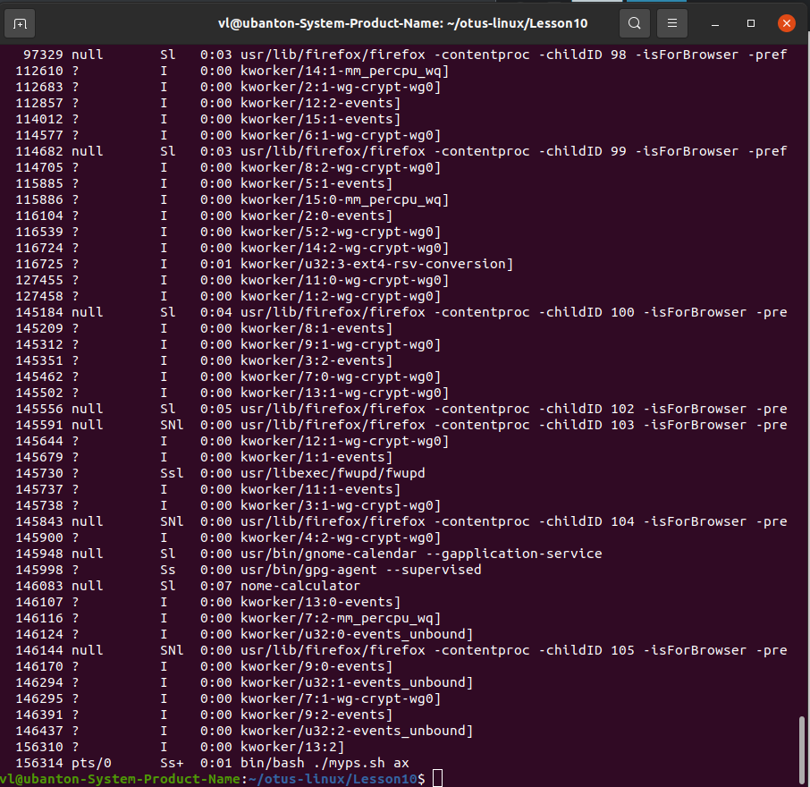
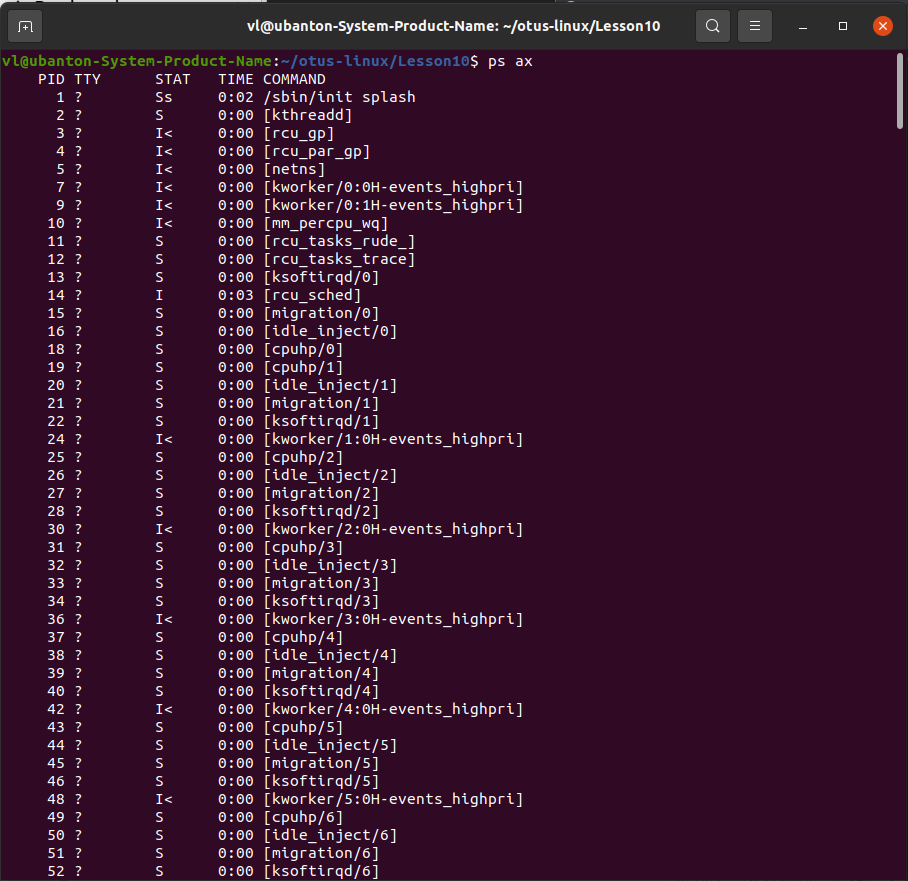

# Домашнее задание "Работаем с процессами"

## Описание/Пошаговая инструкция выполнения домашнего задания:

Задания на выбор:

1. написать свою реализацию ps ax используя анализ /proc
* Результат ДЗ - рабочий скрипт который можно запустить.

2. написать свою реализацию lsof
* Результат ДЗ - рабочий скрипт который можно запустить.

3. дописать обработчики сигналов в прилагаемом скрипте, оттестировать, приложить сам скрипт, инструкции по использованию
* Результат ДЗ - рабочий скрипт который можно запустить + инструкция по использованию и лог консоли.

4. реализовать 2 конкурирующих процесса по IO. пробовать запустить с разными ionice
* Результат ДЗ - скрипт запускающий 2 процесса с разными ionice, замеряющий время выполнения и лог консоли.

5. реализовать 2 конкурирующих процесса по CPU. пробовать запустить с разными nice
* Результат ДЗ - скрипт запускающий 2 процесса с разными nice и замеряющий время выполнения и лог консоли.

**Выбрано задание №1: "написать свою реализацию ps ax используя анализ /proc".**

## Запуск

```
./myps.sh ax
```

## Файлы
myps.sh - скрипт домашнего задания.

## Результат выполнения

1. Результат выполнения 'myps.sh ax'




2. Для сравнения, результат выполнения команды 'ps ax'




