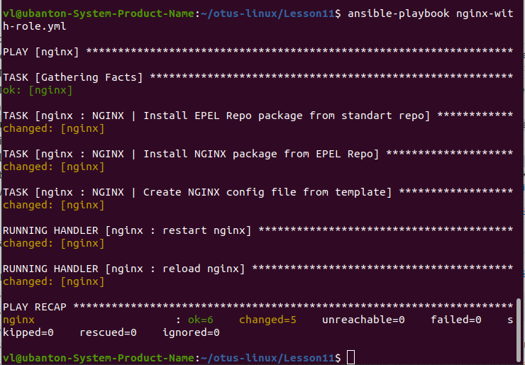
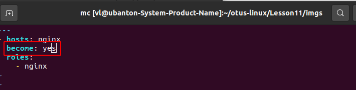
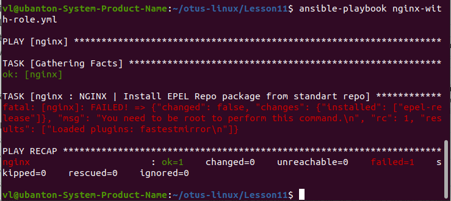
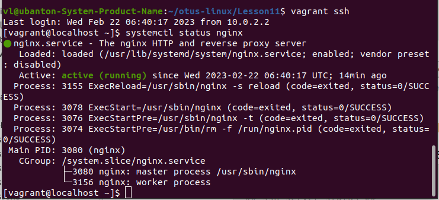
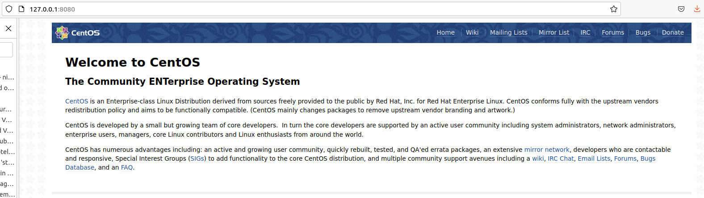

# Домашнее задание "Первые шаги с Ansible"

## Описание/Пошаговая инструкция выполнения домашнего задания:

Для выполнения домашнего задания используйте методичку
https://drive.google.com/file/d/1CKknAPX-Ixnl4ClluCSbQQFne0PMsHBU/view?usp=share_link
Что нужно сделать?
Подготовить стенд на Vagrant как минимум с одним сервером. На этом сервере используя Ansible необходимо развернуть nginx со следующими условиями:

* необходимо использовать модуль yum/apt;
* конфигурационные файлы должны быть взяты из шаблона jinja2 с перемененными;
* после установки nginx должен быть в режиме enabled в systemd;
* должен быть использован notify для старта nginx после установки;
* сайт должен слушать на нестандартном порту - 8080, для этого использовать переменные в Ansible.

### Запуск

1. Создание виртуальной машины
```
vagrant up
```

2. Установка nginx с помощью роли ansible

```
ansible-playbook nginx-with-role.yml
```

3. Альтернативная установка nginx с помощью роли ansible, но без nginx-with-role.yml, только с ролью.

```
ansible nginx --module-name include_role --args name=nginx
```

4. Альтернативная установка с помощью ansible-playbook без ролей.

```
ansible-playbook playbooks/nginx.yml
```

## Файлы

1. Vagrantfile - настройка виртуальной машины.
2. ansible.cfg - настройки ansible. В частности хост и пользователь по умолчанию.
3. epel.yml - файл установки EPEL Repo package - по ДЗ.
4. ansible-playbook playbooks/nginx.yml - установка nginx с помощью роли ansible.
5. ./imgs - скриншоты.
6. ./playbooks/\* - playbook установки nginx.
7. ./roles/nginx - роль установки nginx.
8. ./roles/nginx/defaults/main.yml - переменные по умолчанию.
9. ./roles/nginx/handlers - хэндлеры роли. 
10. ./roles/nginx/tasks - задачи роли.
11. ./roles/nginx/templates - шаблон необходимых для установки nginx.

## Результаты выполнения

Результат установки с помощью команды 'ansible-playbook nginx-with-role.yml'



Если не установить параметр "become: yes"



то возникает ошибка



Статус сервиса после установки:



Работа сервиса:



