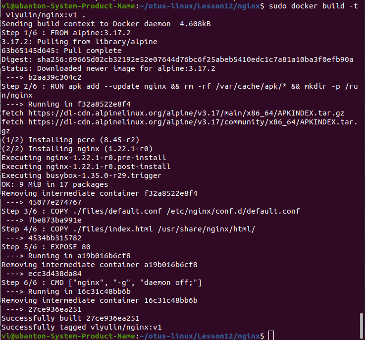
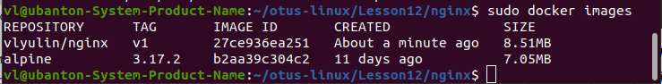
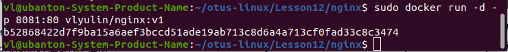
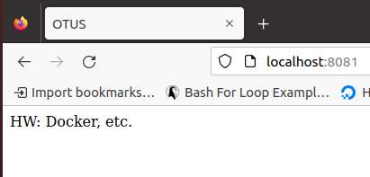
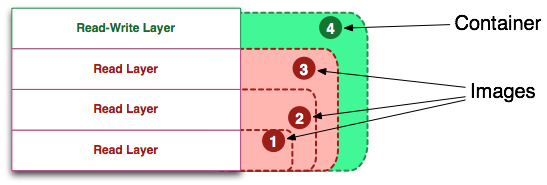
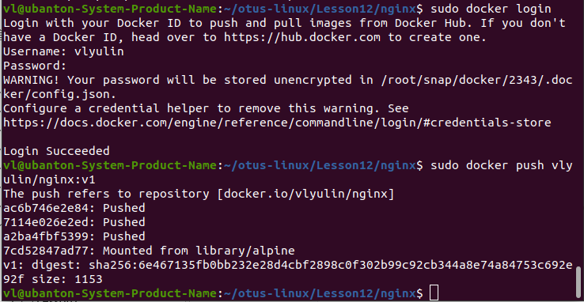
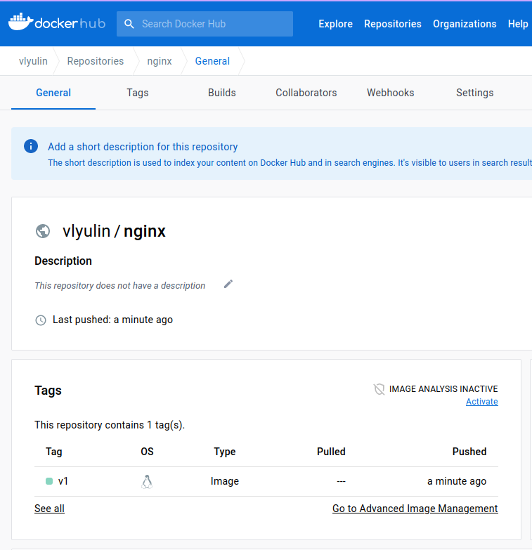

# Домашнее задание "Docker, docker-compose, dockerfile"

## Описание/Пошаговая инструкция выполнения домашнего задания:

1. Создать свой кастомный образ nginx на базе alpine. После запуска nginx должен
отдавать кастомную страницу (достаточно изменить дефолтную страницу nginx)
2. Определить разницу между контейнером и образом.
Вывод опишите в домашнем задании.
3. Ответить на вопрос: Можно ли в контейнере собрать ядро?
4. Собранный образ необходимо запушить в docker hub и дать ссылку на ваш
репозиторий.
5. Задание со * (звездочкой)
Создайте кастомные образы nginx и php, объедините их в docker-compose.
После запуска nginx должен показывать php info.
Все собранные образы должны быть в docker hub

### п.1 "Создать свой кастомный образ nginx на базе alpine."

Директория nginx.

1. Сборка nginx

```
cd ./nginx
docker build -t vlyulin/nginx:v1 .
```
Где vlyulin - имя автора; nginx - название сборки; v1 - версия; . (точка) - поиск Dockerfile выполняется в текущей директории.



2. Проверяем список образов
```
docker images
```



3. Создание и запуск контейнера из образа:

```
docker run --rm -p 8081:80 vlyulin/nginx:v1
```



Проверка в броузере



## п.2 "Определить разницу между контейнером и образом"

Образ Docker (Docker Image) - это неизменяемый файл, содержащий исходный код, библиотеки, зависимости, инструменты и другие файлы, необходимые для запуска приложения. При создании контейнера поверх образа добавляет слой, доступный для записи, что позволяет менять его по своему усмотрению. 



## п.3 "Ответить на вопрос: Можно ли в контейнере собрать ядро?"

Ядро собрать можно, но загрузитья с этим собранным ядром нельзя, т.к. все контейнеры работают на одном и том же ядре host-машины.

## п.4 "Собранный образ необходимо запушить в docker hub и дать ссылку на ваш
репозиторий."

```
docker login
docker push vlyulin/nginx:v1
```





```
docker pull vlyulin/nginx:v1
```

```
https://hub.docker.com/r/vlyulin/nginx
```

## п.5 "Задание со * (звездочкой)"

Директория nginx-php.
Решение подсмотрел.
Запустить не смог, получаю ошибку "404 Not Found".


