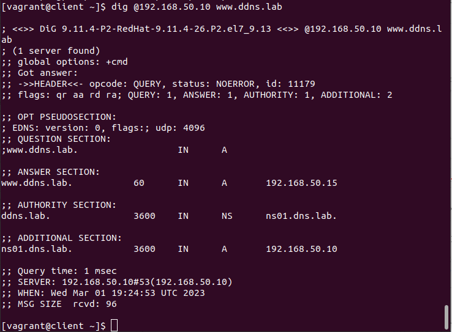

# Домашнее задание "Практика с SELinux"

## Описание/Пошаговая инструкция выполнения домашнего задания:

Для выполнения домашнего задания используйте методичку
https://docs.google.com/document/d/1QwyccIn8jijBKdaoNR4DCtTULEqb5MKK/edit?usp=share_link&ouid=104106368295333385634&rtpof=true&sd=true
Что нужно сделать?

1. Запустить nginx на нестандартном порту 3-мя разными способами:

    * переключатели setsebool;
    * добавление нестандартного порта в имеющийся тип;
    * формирование и установка модуля SELinux.
    К сдаче:
    * README с описанием каждого решения (скриншоты и демонстрация приветствуются).

2. Обеспечить работоспособность приложения при включенном selinux.

    * развернуть приложенный стенд https://github.com/mbfx/otus-linux-adm/tree/master/selinux_dns_problems;
    * выяснить причину неработоспособности механизма обновления зоны (см. README);
    * предложить решение (или решения) для данной проблемы;
    * выбрать одно из решений для реализации, предварительно обосновав выбор;
    * реализовать выбранное решение и продемонстрировать его работоспособность.
    К сдаче:
    * README с анализом причины неработоспособности, возможными способами решения и обоснованием выбора одного из них;
    * исправленный стенд или демонстрация работоспособной системы скриншотами и описанием.

## 0. Создание виртуальной машины

```
vagrant up
```

Ошибка запуска nginx при установке:


Данная ошибка появляется из-за того, что SELinux блокирует работу nginx на нестандартном порту.

## 1. Запуск nginx на нестандартном порту 3-мя разными способами

```
vagrant ssh
sudo -i
```

Проверка, что в ОС отключен файервол: 
```
systemctl status firewalld
```


Проверка, что конфигурация nginx настроена без ошибок: 
```
nginx -t
```


Провека режима работы SELinux: 
```
getenforce
```


### Разрешение в SELinux работу nginx на порту TCP 4881 c помощью переключателей setsebool

Нахождение в логах (/var/log/audit/audit.log) информацию о блокировании порта:

```
grep /var/log/audit/audit.log -e '4881'
```


Установка audit2why

```
yum provides \*/audit2allow
```


Установка audit2why

```
yum install policycoreutils-python
```

Информация о запрете:
```
grep /var/log/audit/audit.log -e '4881' | audit2why
```


Изменение параметра:

```
setsebool -P nis_enabled 1
systemctl restart nginx
systemctl status nginx
```


Проверка работопособности в броузере:


Проверка статуса параметра можно с помощью команды:

```
getsebool -a | grep nis_enabled
```


Вщзврат запрета работы nginx на порту 4881 обратно:
```
setsebool -P nis_enabled off
```

### Разрешение в SELinux работы nginx на порту TCP 4881 c помощью добавления нестандартного порта в имеющийся тип

Поиск имеющегося типа, для http трафика: 
```
semanage port -l | grep http
```


Добавление порта в тип http_port_t: 
```
semanage port -a -t http_port_t -p tcp 4881
semanage port -l | grep http_port_t
```


Проверка работы nginx:


Удаление нестандартного порта из имеющегося типа можно с помощью команды: 
```
semanage port -d -t http_port_t -p tcp 4881
```

### Разрешение в SELinux работу nginx на порту TCP 4881 c помощью формирования и установки модуля SELinux

Воспользуемся утилитой audit2allow для того, чтобы на основе логов SELinux сделать модуль, разрешающий работу nginx на нестандартном порту: 
```
grep nginx /var/log/audit/audit.log | audit2allow -M nginx
```

Выполнение команды предложенной утилитой audit2allow:
```
semodule -i nginx.pp
```

Запуск и проверка запуска nginx:
```
systemctl start nginx
systemctl status nginx
```


Просмотр всех установленных модулей: 
```
semodule -l
```

Удаление модуля: 
```
semodule -r nginx
```

## 2. Обеспечение работоспособности приложения при включенном SELinux

Клонирование репозитория: 
```
git clone https://github.com/mbfx/otus-linux-adm.git
```

Сздание окружения
```
cd otus-linux-adm/selinux_dns_problems
vagrant up
```

Проверка ВМ с помощью команды: 
```
vagrant status
```


Подключимся к клиенту: 
```
vagrant ssh client
```
Попробуем внести изменения в зону: 
```
nsupdate -k /etc/named.zonetransfer.key
> server 192.168.50.10
> zone ddns.lab
> update add www.ddns.lab. 60 A 192.168.50.15
> send
```

Подключение к серверу ns01 и проверка логов SELinux:


В логах мы видим, что ошибка в контексте безопасности. Вместо типа named_t используется тип etc_t.

Проверим данную проблему в каталоге /etc/named:


Изменим тип контекста безопасности для каталога /etc/named: 
```
sudo chcon -R -t named_zone_t /etc/named
```


Попробуем снова внести изменения с клиента: 
[vagrant@client ~]$ nsupdate -k /etc/named.zonetransfer.key
> server 192.168.50.10
> zone ddns.lab
> update add www.ddns.lab. 60 A 192.168.50.15
> send
> quit

```
dig www.ddns.lab
```


Перегружаем окружения и выполняем проверку:

```
dig @192.168.50.10 www.ddns.lab
```




