# Домашнее задание "Настройка мониторинга"

## Описание/Пошаговая инструкция выполнения домашнего задания:

Настроить дашборд с 4-мя графиками

   -  память;
   -  процессор;
   -  диск;
   -  сеть.
    
Настроить на одной из систем:
* zabbix (использовать screen (комплексный экран);
* prometheus - grafana.

Использование систем, примеры которых не рассматривались на занятии \*
Список возможных систем был приведен в презентации.
    
В качестве результата прислать скриншот экрана - дашборд должен содержать в названии имя приславшего.

## Выполнение ДЗ

Выбрана установка и настройка prometheus - grafana.
ДЗ выполнено на основе материалов:
https://github.com/Einsteinish/Docker-Compose-Prometheus-and-Grafana
https://grafana.com/docs/grafana-cloud/quickstart/docker-compose-linux/

### Запуск 

```
cd ./Lesson14
docker-compose up -d
```

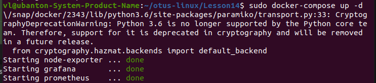

Проверка работоспособности:
```
docker-compose ps
```

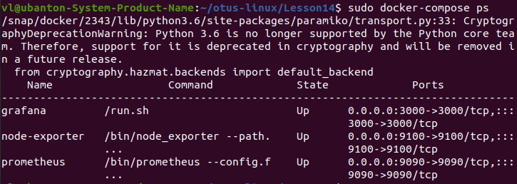


Если что-то пошло не так, то можно посмотреть логи:
```
docker-compose logs -f prometheus
```

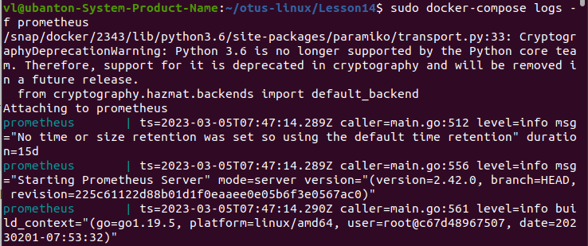

### Доступы к системам

Dashboard Prometheus
http://localhost:9090

Метрики самого Prometheus
http://localhost:9090/metrics

Grafana
http://localhost:3000
Login: admin/admin

Grafana dashboard 'Vlyulin Host'
http://localhost:3000/d/V53s6_b4k/vlyulin-host?orgId=1&refresh=10s


### Файлы

1. ./docker-compose.yml - главный файл установки систем.
2. ./prometheus.yml - настройки Prometheus
3. ./grafana.cfg - настройки Grafana
4. ./grafana/provisionin/datasources/datasource.yml - настройка источников данных для Grafana
5. ./grafana/provisionin/dashboards/dashboard.yml - определение пути к dashboards
6. ./grafana/provisionin/dashboards/docker_host.json - определение dashboard для метрик моей системы. Источник указывается в тэге "datasource": "Prometheus", который пределяется в ./grafana/provisionin/datasources/datasource.yml


### Результаты

Grafana, Vlyulin Host dashboard
http://localhost:3000/d/V53s6_b4k/vlyulin-host?orgId=1&refresh=10s

Память:
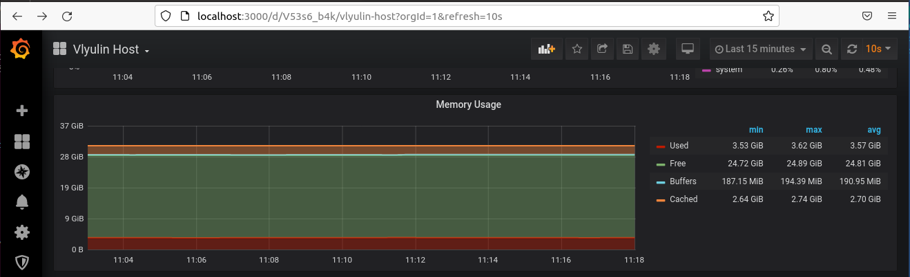

Процессор:
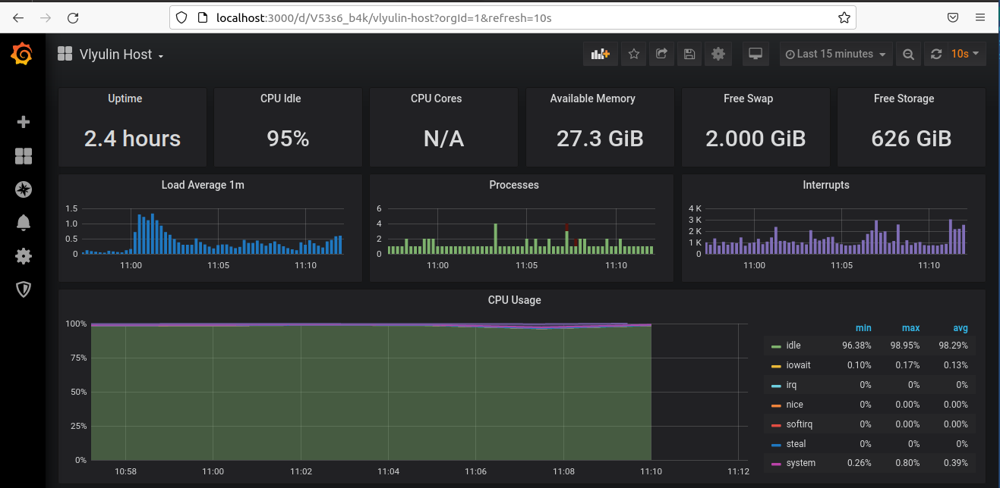

Диск:
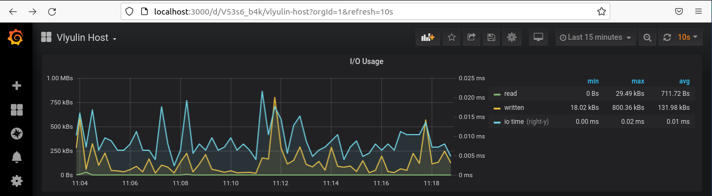

Сеть:
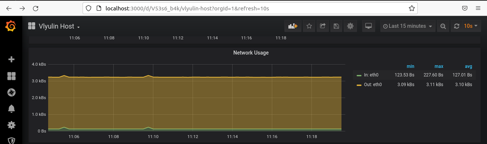

Результат выполнения задания "Дашборд должен содержать в названии имя приславшего":
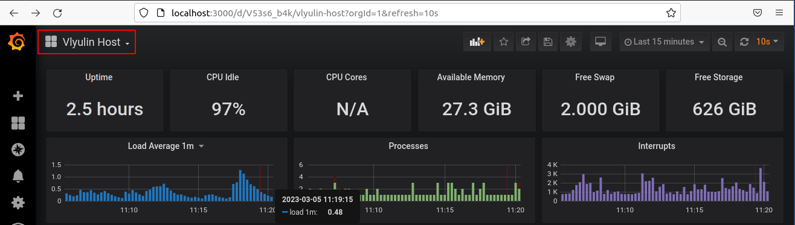

Пример настройки метрик в Grafana dashboard:
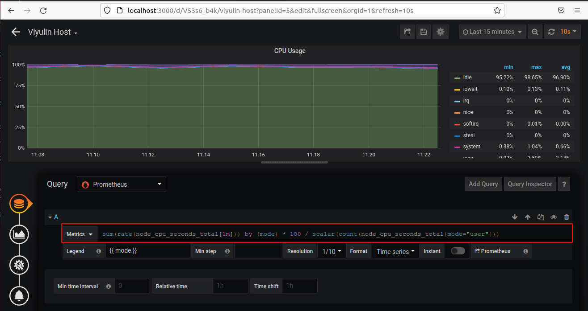

Метрики самого Prometheus
http://localhost:9090/metrics

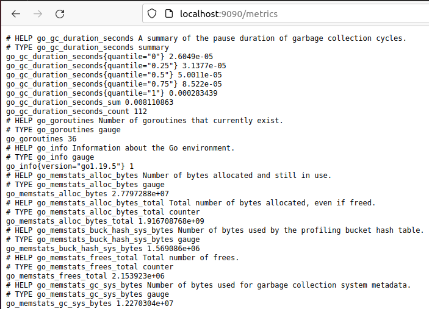

Берем любую метрику из списка и смотрим в Dashboard Prometheus

Dashboard Prometheus
http://localhost:9090

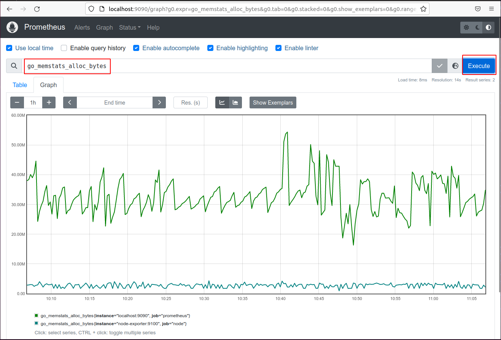

### Заметки

Сбор метрик локального хоста выполняется node-exporter настраиваемого в docker-compose.yml. Для которого настраиваются пути к локальным директориям в режиме read-only:

```
volumes:
      - /proc:/host/proc:ro
      - /sys:/host/sys:ro
      - /:/rootfs:ro
```

Получение метрик с хоста Prometheus настраивается в файле prometheus.yml

```
- job_name: "node"
    scrape_interval: 5s
    static_configs:
      - targets: ['node-exporter:9100']
```

Источник данных для Grafana указывается в ./grafana/provisionin/datasources/datasource.yml

```
datasources:
  - name: Prometheus
    type: prometheus
    access: proxy
    orgId: 1
    url: http://prometheus:9090
    basicAuth: false
    isDefault: true
    editable: true
```


