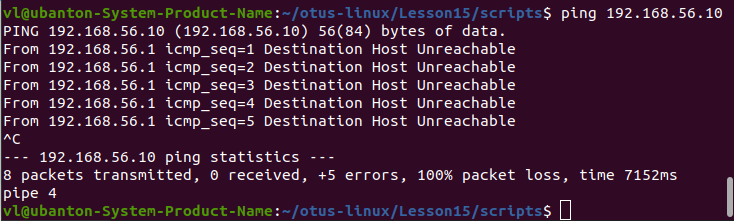
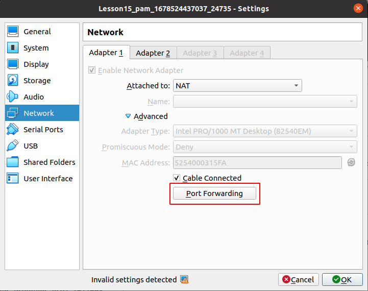
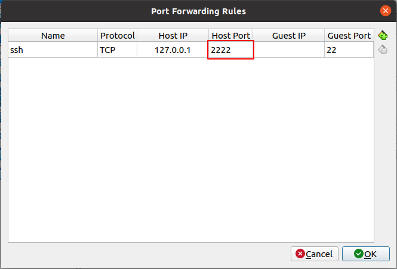
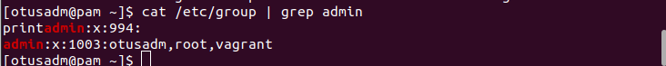
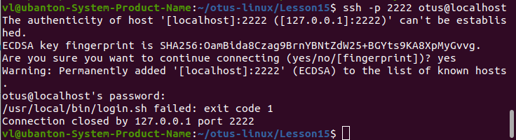
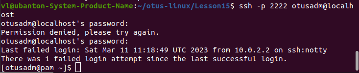

# Домашнее задание "PAM"

## Описание/Пошаговая инструкция выполнения домашнего задания:

Для выполнения домашнего задания используйте методичку
https://docs.google.com/document/d/1lOFe3rv0QcnvOTNfQm0OMHbNQ0Cet6AR/edit?usp=share_link&ouid=104106368295333385634&rtpof=true&sd=true

Что нужно сделать?
1) Запретить всем пользователям, кроме группы admin логин в выходные (суббота и воскресенье), без учета праздников
\*) Дать конкретному пользователю права работать с докером и возможность рестартить докер сервис

## Выполнение ДЗ

**_NOTE:_** Без задания со **

### Запуск

```
vagrant up
```

У меня напрямую guest не пингуется.



Нашел быстрый обходной путь.
Запускаем VirtualBox и для VM cмотрим проброску портов.





Далее для соединения с VM с помощью ssh используется команда 

```
ssh -p root@127.0.0.1
```

### Файлы

1. Vagrantfile - настройка VM
2. scripts/login.sh - скрипт контроля, рапрет рработы по выходным, кроме пользователей (несчастных людей), входящих в группу admin.

### Результаты

Проверка, что пользователи root, vagrant и otusadm есть в группе admin:



Соединение под пользователем otus



Соединение под пользователем otusadm




