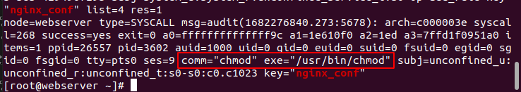

# Домашнее задание "Настраиваем центральный сервер для сбора логов"

## Описание/Пошаговая инструкция выполнения домашнего задания:

Для выполнения домашнего задания используйте методичку:
https://docs.google.com/document/d/16UBAMu4LYqvRv6PmCeHcmOampMrIZavH/edit?usp=share_link&ouid=104106368295333385634&rtpof=true&sd=true

### Цель домашнего задания

Научится проектировать централизованный сбор логов. Рассмотреть особенности разных платформ для сбора логов.

### Описание домашнего задания

Что нужно сделать?

1. в вагранте поднимаем 2 машины web и log

2. на web поднимаем nginx

3. на log настраиваем центральный лог сервер на любой системе на выбор

   * journald;
   * rsyslog;
   * elk.

4. настраиваем аудит, следящий за изменением конфигов нжинкса.
Все критичные логи с web должны собираться и локально и удаленно.
Все логи с nginx должны уходить на удаленный сервер (локально только критичные).
Логи аудита должны также уходить на удаленную систему.

Формат сдачи ДЗ - vagrant + ansible

## Запуск

```
vagrant up
```

## Решение

Созданы две ВМ `web-server` и `log-server`. \
На `web-server` установлен `nginx` на `log-server` настроена приёмка логов и информации аудита.

nginx доступен по адресу http://127.0.0.1:8081

### Настройка передачи логирования на log-server

Отправку логов с `web-сервера` настроена в файле: /etc/nginx/conf.d/mydomain.conf
через шаблон mydomain.j2

```
    # Remote loging service nginx
    error_log /var/log/nginx/error.log;
    error_log syslog:server={{ log_server_ip }}:{{ port }},tag=nginx_error;
    access_log syslog:server={{ log_server_ip }}:{{ port }},tag=nginx_access,severity=info combined;
```

На `log-server` настраиваем 514 порт для приема log-сообщений.
См. rsyslog-conf.j2

```
# Provides UDP syslog reception
$ModLoad imudp
$UDPServerRun 514

# Provides TCP syslog reception
$ModLoad imtcp
$InputTCPServerRun 514
```

И возможность приема log сообщений с любого хоста
```
# ============== Add remote logs ====================================
$template RemoteLogs,"/var/log/rsyslog/%HOSTNAME%/%PROGRAMNAME%.log"
*.* ?RemoteLogs
& ~
```

При активности на `web-server` на `log-server` создается папка `webserver`.


И в файле nginx_access.log содержится log-информация:


### Настройка передачи аудита, контролирующего изменения конфигурации nginx, на log-server

За аудит отвечает утилита auditd, в RHEL-based системах обычно она уже предустановлена.
Это можно проверить командой:
```
rpm -qa | grep audit
```

Правила для отслеживания изменения в конфигруации nginx добавляются в конец
файла /etc/audit/rules.d/audit.rules через шаблон audit_rules.j2:

```
# Add rules for nginx
-w /etc/nginx/nginx.conf -p wa -k nginx_conf
-w /etc/nginx/default.d/ -p wa -k nginx_conf
-w /etc/nginx/conf.d/ -p wa -k nginx_conf
``` 

После перезапуска службу `auditd`

```
service auditd restart
```

проверяем локальную, на `web-server`, работу аудита



Пересылка audit-логов выполняется с помощью audispd-plugins.
Для этого на web-server в файле /etc/audisp/audisp-remote.conf требуется указать адрес сервера и порт, на который будут отправляться логи.
См. шаблон web-audisp-remote-conf.j2
```
remote_server = {{ log_server_ip }}
port = {{ port_audit }}
```

А в файле /etc/audisp/plugins.d/au-remote.conf через шаблон web-au-remote-conf.j2 указывается
```
active = yes
```

На `log-server` в файле /etc/audit/auditd.conf (шаблон log-auditd-conf.j2) открывается порт 60.
```
tcp_listen_port = {{ audit_listen_port }}
```


На `web-server` и `log-server` после настройки требуется перезапустить `audit service`
```
service auditd restart
```

Проверка работоспособности:


