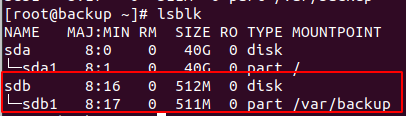
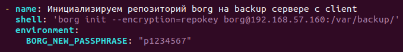
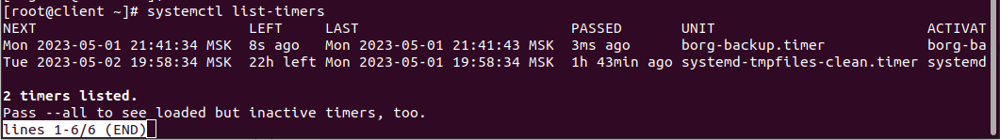
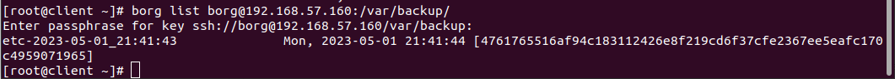
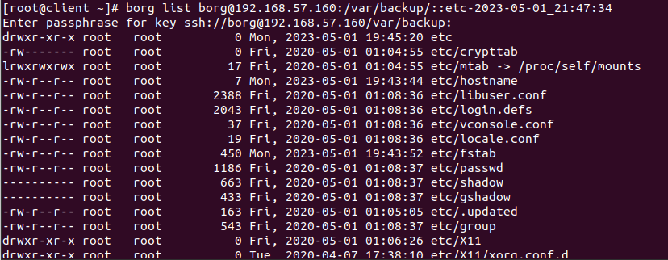
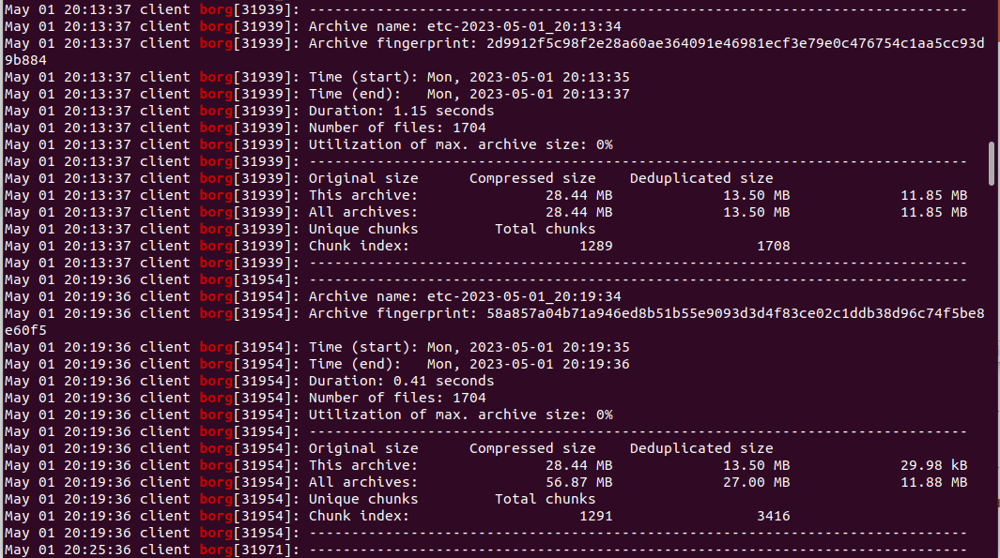
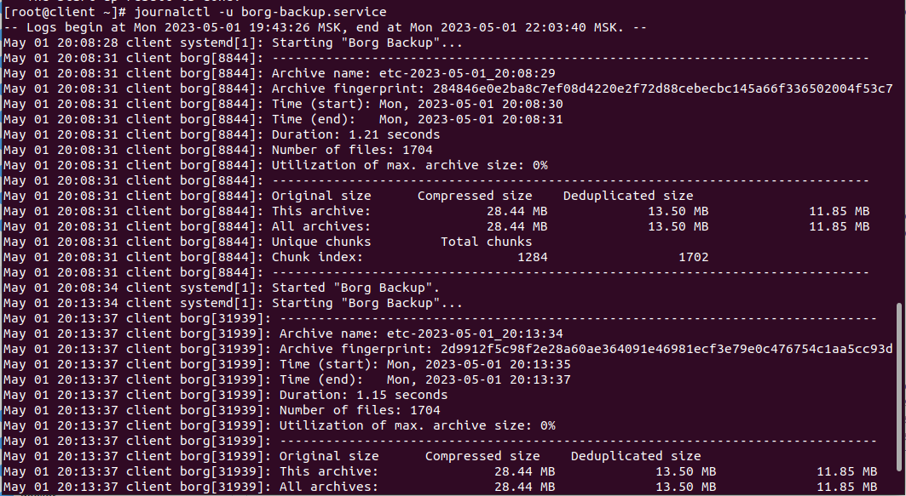

# Домашнее задание "Настраиваем бэкапы"

## Описание/Пошаговая инструкция выполнения домашнего задания:

Для выполнения домашнего задания используйте методичку:
https://docs.google.com/document/d/1L0VtVCn2tXmC0Pirlfhnr6rEpOANbP-C/edit?usp=share_link&ouid=104106368295333385634&rtpof=true&sd=true

### Цель домашнего задания


### Описание домашнего задания

Что нужно сделать?

Настроить стенд Vagrant с двумя виртуальными машинами: backup_server и client.
Настроить удаленный бекап каталога /etc c сервера client при помощи borgbackup. Резервные копии должны соответствовать следующим критериям:

* директория для резервных копий /var/backup. Это должна быть отдельная точка монтирования. В данном случае для демонстрации размер не принципиален, достаточно будет и 2GB;
* репозиторий дле резервных копий должен быть зашифрован ключом или паролем - на ваше усмотрение;
* имя бекапа должно содержать информацию о времени снятия бекапа;
* глубина бекапа должна быть год, хранить можно по последней копии на конец месяца, кроме последних трех. Последние три месяца должны содержать копии на каждый день. Т.е. должна быть правильно настроена политика удаления старых бэкапов;
* резервная копия снимается каждые 5 минут. Такой частый запуск в целях демонстрации;
* написан скрипт для снятия резервных копий. Скрипт запускается из соответствующей Cron джобы, либо systemd timer-а - на ваше усмотрение;
* настроено логирование процесса бекапа. Для упрощения можно весь вывод перенаправлять в logger с соответствующим тегом. Если настроите не в syslog, то обязательна ротация логов.
    
Запустите стенд на 30 минут.  
Убедитесь что резервные копии снимаются.  
Остановите бекап, удалите (или переместите) директорию /etc и восстановите ее из бекапа.  

Для сдачи домашнего задания ожидаем настроенные стенд, логи процесса бэкапа и описание процесса восстановления.

Формат сдачи ДЗ - vagrant + ansible

## Запуск

```
vagrant up
```

## Решение

1. директория для резервных копий /var/backup. Это должна быть отдельная точка монтирования. В данном случае для демонстрации размер не принципиален, достаточно будет и 2GB; (Студент самостоятельно настраивает)



2. репозиторий для резервных копий должен быть зашифрован ключом или паролем - на ваше усмотрение;



3. имя бэкапа должно содержать информацию о времени снятия бекапа;

См. файл: provisioning/files/borg-backup.sevice

```
ExecStart=/bin/borg create --stats ${REPO}::etc-{now:%%Y-%%m-%%d_%%H:%%M:%%S} ${BACKUP_TARGET}
```

4. глубина бекапа должна быть год, хранить можно по последней копии на конец месяца, кроме последних трех. Последние три месяца должны содержать копии на каждый день. Т.е. должна быть правильно настроена политика удаления старых бэкапов;

См. файл: provisioning/files/borg-backup.sevice
```
ExecStart=/bin/borg prune --keep-daily 90 --keep-monthly 12 --keep-yearly 1 ${REPO}
```

5. резервная копия снимается каждые 5 минут. Такой частый запуск в целях демонстрации;

См. файл: provisioning/files/borg-backup.timer
```
[Timer]
OnUnitActiveSec=5min
```

Статус таймера:
```
systemctl list-timers
```



6. написан скрипт для снятия резервных копий. Скрипт запускается из соответствующей Cron джобы, либо systemd timer-а - на ваше усмотрение;

См. файл: provisioning/files/borg-backup.service

```
borg list borg@192.168.57.160:/var/backup/
```



Содержимое бэкапа:


7. настроено логирование процесса бекапа. Для упрощения можно весь вывод перенаправлять в logger с соответствующим тегом. 

Настройка:
См. файл: provisioning/files/borg-backup.service

```
StandardOutput=journal
StandardError=journal
SyslogIdentifier=borg
```

Проверка:

```
journalctl | grep borg
```



или

```
journalctl -u borg-backup.service
```



