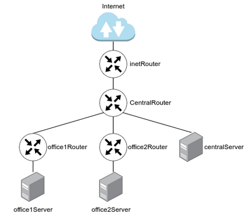
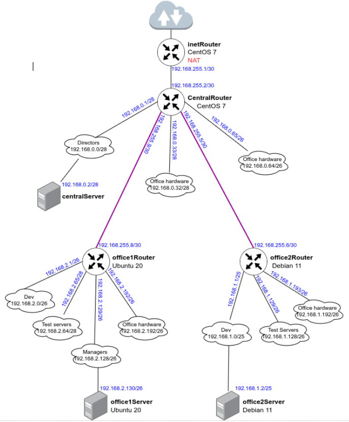
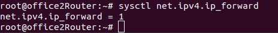
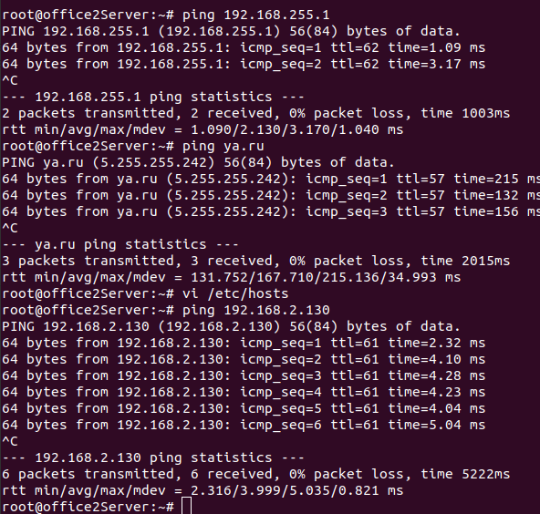

# Домашнее задание "Разворачиваем сетевую лабораторию"

## Описание/Пошаговая инструкция выполнения домашнего задания:

Для выполнения домашнего задания используйте методичку:
https://docs.google.com/document/d/1XtCmYJYPKwoMDjwiTskALvYLZaE4I49g/edit?usp=share_link&ouid=104106368295333385634&rtpof=true&sd=true

### Цель домашнего задания
Создать домашнюю сетевую лабораторию. Научится менять базовые сетевые настройки  в Linux-based системах.

### Описание домашнего задания
1. Скачать и развернуть Vagrant-стенд (https://github.com/erlong15/otus-linux/tree/network)
2. Построить следующую сетевую архитектуру:

Сеть office1
- 192.168.2.0/26      - dev
- 192.168.2.64/26     - test servers
- 192.168.2.128/26    - managers
- 192.168.2.192/26    - office hardware

Сеть office2
- 192.168.1.0/25      - dev
- 192.168.1.128/26    - test servers
- 192.168.1.192/26    - office hardware

Сеть central
- 192.168.0.0/28     - directors
- 192.168.0.32/28    - office hardware
- 192.168.0.64/26    - wifi



Итого должны получиться следующие сервера:
	* inetRouter
	* centralRouter
	* office1Router
	* office2Router
	* centralServer
	* office1Server
	* office2Server

**Задание состоит из 2-х частей: теоретической и практической.**

В теоретической части требуется: 
* Найти свободные подсети
* Посчитать количество узлов в каждой подсети, включая свободные
* Указать Broadcast-адрес для каждой подсети
* Проверить, нет ли ошибок при разбиении

В практической части требуется: 
* Соединить офисы в сеть согласно логической схеме и настроить роутинг
* Интернет-трафик со всех серверов должен ходить через inetRouter
* Все сервера должны видеть друг друга (должен проходить ping)
* У всех новых серверов отключить дефолт на NAT (eth0), который vagrant поднимает для связи
* Добавить дополнительные сетевые интерфейсы, если потребуется

Рекомендуется использовать Vagrant + Ansible для настройки данной схемы.

## Решение

### 1. Теоретическая часть

**Топология сети**

|Наименование 	|Сеть 		  |Маска   	   |Кол-во адр 	|Первый адрес   |Последний адрес|Broadcast   	|
|---		|---		  |---		   |---		|---		|---		|---		|
| Central Network
|---		|---		  |---		   |---		|---		|---		|---		|
|Directors   	|192.168.0.0/28   |255.255.255.240 |14		|192.168.0.1 	|192.168.0.14 	|192.168.0.15 	|
|Office hardware|192.168.0.32/28  |255.255.255.240 |14		|192.168.0.33 	|192.168.0.46 	|192.168.0.47 	|
|WiFi (mgt)     |192.168.0.64/26  |255.255.255.192 |62		|192.168.0.65 	|192.168.0.126 	|192.168.0.127 	|
|---		|---		  |---		   |---		|---		|---		|---		|
| Office 1 network
|---		|---		  |---		   |---		|---		|---		|---		|
|Dev   	        |192.168.2.0/26   |255.255.255.192 |62		|192.168.2.1 	|192.168.2.62 	|192.168.2.63 	|
|Test  	        |192.168.2.64/26  |255.255.255.192 |62		|192.168.2.65 	|192.168.2.126 	|192.168.2.127 	|
|Managers       |192.168.2.128/26 |255.255.255.192 |62		|192.168.2.129 	|192.168.2.190 	|192.168.2.191 	|
|Office HW      |192.168.2.192/26 |255.255.255.192 |62		|192.168.2.193 	|192.168.2.254 	|192.168.2.255 	|
|---		|---		  |---		   |---		|---		|---		|---		|
| Office 2 network
|---		|---		  |---		   |---		|---		|---		|---		|
|Dev   	        |192.168.1.0/25   |255.255.255.128 |126		|192.168.1.1 	|192.168.1.126 	|192.168.1.127 	|
|Test  	        |192.168.1.128/26 |255.255.255.192 |62		|192.168.1.129 	|192.168.1.190 	|192.168.1.191 	|
|Office	        |192.168.1.192/26 |255.255.255.192 |62		|192.168.1.193 	|192.168.1.254 	|192.168.1.255 	|
|---		|---		  |---		   |---		|---		|---		|---		|
| InetRouter — CentralRouter network
|---		|---		  |---		   |---		|---		|---		|---		|
|Inet - central |192.168.255.0/30 |255.255.255.252 |2		|192.168.255.1 	|192.168.255.2 	|192.168.255.3 	|
|---		|---		  |---		   |---		|---		|---		|---		|

Q: Найти свободные подсети  
A: 

|Наименование 	|Сеть 		  |Маска   	   |Кол-во адр 	|Первый адрес   |Последний адрес|Broadcast   	|
|---		|---		  |---		   |---		|---		|---		|---		|
|		|192.168.0.16/28  |255.255.255.240 |14		|192.168.0.17 	|192.168.0.30 	|192.168.0.31 	|
|		|192.168.0.48/28  |255.255.255.240 |14		|192.168.0.49 	|192.168.0.62 	|192.168.0.63 	|
|		|192.168.0.128/25 |255.255.255.128 |126		|192.168.0.129 	|192.168.0.255 	|192.168.0.255 	|
|		|192.168.255.4/30 |255.255.255.252 |2	        |192.168.255.5 	|192.168.255.6 	|192.168.255.7 	|
|		|192.168.255.8/29 |255.255.255.248 |6	        |192.168.255.9 	|192.168.255.14	|192.168.255.15	|
|		|192.168.255.16/28|255.255.255.240 |14	        |192.168.255.17	|192.168.255.30	|192.168.255.31	|
|		|192.168.255.32/27|255.255.255.224 |30	        |192.168.255.33	|192.168.255.62	|192.168.255.63	|
|		|192.168.255.64/26|255.255.255.192 |62	        |192.168.255.65	|192.168.255.126|192.168.255.127|
|		|192.168.255.128/25|255.255.255.128 |128        |192.168.255.129|192.168.255.254|192.168.255.255|

Q: Посчитать количество узлов в каждой подсети, включая свободные  
A: Указано в колонке "Кол-во адр"

Q: Указать Broadcast-адрес для каждой подсети  
A: Указано в колонке "Broadcast"

Q: Проверить, нет ли ошибок при разбиении  
A: Нет. 

### 2. Практическая часть

**Топология сети**



#### Установка окружения

```
vagrant up
```

#### Проверка работоспособности

Проверка включения forward на роутерах

```
sysctl net.ipv4.ip_forward
```

Пример office2Router



Доступность интернета и других узлов на примере office2Server



Примечание: 
проблемы с provision Debian серверов. Не всегда выполняется.
Проверять что прописалось в файле /etc/network/interfaces
Если в них нет строк удаления default роутинга для eth0 и установка его для eth1, то как обходной вариант прописать его вручную.

**office2Router**
```
# Delete default router
post-up ip route del default dev eth0 || true
#default route
post-up ip route add 0.0.0.0/0 via 192.168.255.5
```
См. provisioning/templates/office2Router-interfaces.j2

**office2Server**
```
# Delete default router
post-up ip route del default dev eth0 || true
# Default route
post-up ip route add 0.0.0.0/0 via 192.168.1.1
```
См. provisioning/templates/office2Server-interfaces.j2

После чего выполнить команду
```
ifdown eth0 && ifup eth0 && ifdown eth1 && ifup eth1
```

