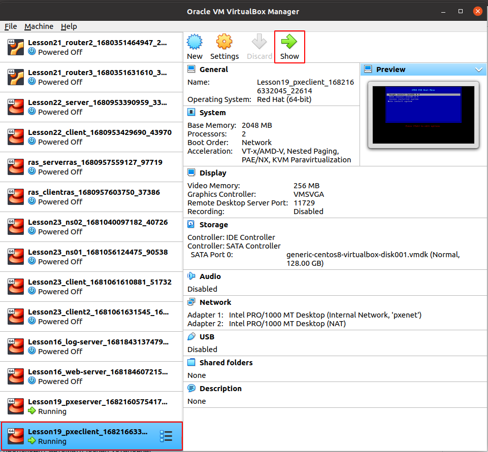
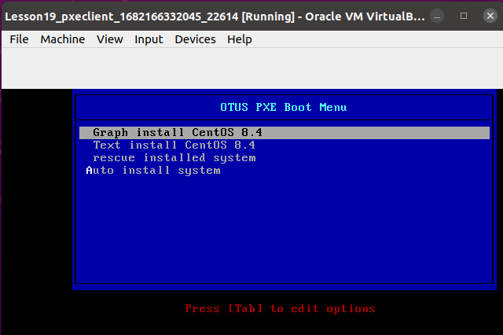
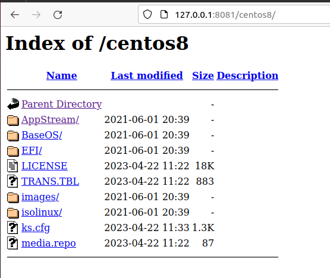

# Домашнее задание "Настройка PXE сервера для автоматической установки"

## Описание/Пошаговая инструкция выполнения домашнего задания:

Для выполнения домашнего задания используйте методичку:
https://docs.google.com/document/d/1f5I8vbWAk8ah9IFpAQWN3dcWDHMqXzGb/edit?usp=share_link&ouid=104106368295333385634&rtpof=true&sd=true

### Цель домашнего задания
Отрабатываем навыки установки и настройки DHCP, TFTP, PXE загрузчика и автоматической загрузки.

### Описание домашнего задания

Что нужно сделать?

1. Следуя шагам из документа https://docs.centos.org/en-US/8-docs/advanced-install/assembly_preparing-for-a-network-install установить и настроить загрузку по сети для дистрибутива CentOS8.

В качестве шаблона воспользуйтесь репозиторием https://github.com/nixuser/virtlab/tree/main/centos_pxe.

2. Поменять установку из репозитория NFS на установку из репозитория HTTP.

3. Настроить автоматическую установку для созданного kickstart файла (*) Файл загружается по HTTP.

Задание со звездочкой \*
автоматизировать процесс установки Cobbler cледуя шагам из документа https://cobbler.github.io/quickstart/.

Формат сдачи ДЗ - vagrant + ansible

## Запуск

В директорию ./sources скачать два файла:
  - CentOS-8.4.2105-x86_64-boot.iso
  - CentOS-8.4.2105-x86_64-dvd1.iso

Создать dhcp сервер pxeserver

```
vagrant up pxeserver
```

Создать клиента pxeclient

```
vagrant up pxeclient
```

Запустить VirtualBox

```
> VirtualBox
```

Выбрать ВМ pxeclient и перегрузить её.



Появится окно с приглашением установки:



## Заметки

Для разрешения доступа к http://127.0.0.1:8081/centos8/ без отключения selinux,
в provisioning/provision.yml добавлена задача:

```
- name: add permision to /iso through Apache
    shell: sudo chcon -R -t httpd_sys_content_t /iso
```




