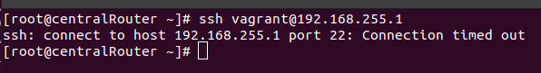
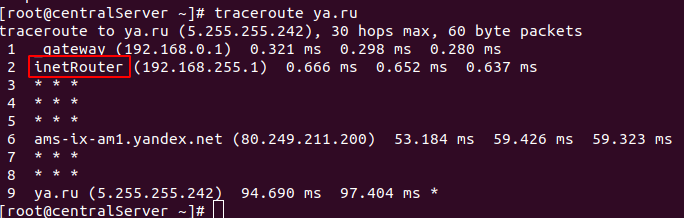
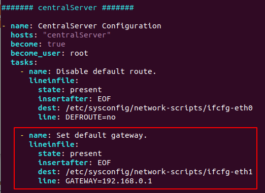

# Сценарии iptables 

## Описание/Пошаговая инструкция выполнения домашнего задания:

Что нужно сделать?

1. Реализовать knocking port
   * centralRouter может попасть на ssh inetrRouter через knock скрипт пример в материалах.
2. Добавить inetRouter2, который виден(маршрутизируется (host-only тип сети для виртуалки)) с хоста или форвардится порт через локалхост.
3. Запустить nginx на centralServer.
4. Пробросить 80й порт на inetRouter2 8080.
5. Дефолт в инет оставить через inetRouter.

Формат сдачи ДЗ - vagrant + ansible

**Задание со \* **: реализовать проход на 80й порт без маскарадинга

## Настройка окружения

1. За основу всят стедн из ДЗ №18:
https://github.com/vlyulin/otus-linux/tree/master/Lesson18

2. Оставлены следующие сервера

<table>
  <thead>
    <tr>
      <th>Server</th>
      <th>IP</th>
      <th>Net</th>
      <th>OS</th>
    </tr>
  </thead>
  <tbody>
    <!-- inetRouter -->
    <tr>
      <td rowspan=2>inetRouter</td>
      <td>192.168.255.1/30</td>
      <td>router-net</td>
      <td rowspan=2>Centos 7</td>
    </tr>
    <tr>
      <td>192.168.56.10/24</td>
      <td>for ansible</td>      
    </tr>
    <!-- centralRouter -->
    <tr>
      <td rowspan=4>centralRouter</td>
      <td>192.168.255.2/30</td>
      <td>router-net</td>
      <td rowspan=4>Centos 7</td>
    </tr>
    <tr>
      <td>192.168.0.1/28</td>
      <td>dir-net</td>      
    </tr>
    <tr>
      <td>192.168.0.33/28</td>
      <td>hw-net</td>      
    </tr> 
    <tr>
      <td>192.168.56.11/24</td>
      <td>for ansible</td>      
    </tr> 
    <!-- centralServer -->
    <tr>
      <td rowspan=2>centralServer</td>
      <td>192.168.0.1/28</td>
      <td>dir-net</td>
      <td rowspan=2>Centos 7</td>
    </tr>
    <tr>
      <td>192.168.56.12/24</td>
      <td>for ansible</td>      
    </tr>
    <!-- inetRouter2 -->
    <tr>
      <td rowspan=2>inetRouter2</td>
      <td>192.168.0.34/28</td>
      <td>dir-net</td>
      <td rowspan=2>Centos 7</td>
    </tr>
    <tr>
      <td>192.168.56.13/24</td>
      <td>for ansible</td>      
    </tr>
  </tbody>
</table>

3. Запуск окружения

```
vagrant up
```

## Решение
### 1. Реализовать knocking port
\* centralRouter может попасть на ssh inetrRouter через knock скрипт пример в материалах.

Решение на основе матириала: https://otus.ru/nest/post/267/
Примечание: добавлены следующие правила для возможности работы ansible во время создания вируальных машин:
```
-A INPUT -p tcp -s 10.0.0.2/16 -m tcp --dport 22 -j ACCEPT
-A INPUT -p tcp -s 192.168.56.0/24 -m tcp --dport 22 -j ACCEPT
```

Попытка подключения без knock.sh скрипта:



Подключение не выполнено.

Подключение с использованием knock.sh скрипта:


Подключение успешно, т.к. скрипт knock.sh последовательно выполнил присоединение к портам 8881, 7777 и 9991, после чего была возможность в течение 30 секунд выполнить ssh подключение.

### 2. Добавить inetRouter2, который виден (маршрутизируется (host-only тип сети для виртуалки)) с хоста или форвардится порт через локалхост.

См. Vagrantfile
```
:inetRouter2 => {
        :box_name => "centos/7",
        :vm_name => "inetRouter2",
        :net => [
                   {ip: '192.168.0.34', adapter: 2, netmask: "255.255.255.240", virtualbox__intnet: "hw-net"},
                   {ip: '192.168.56.13', adapter: 8},
                ]
  }
```

### 3. Запустить nginx на centralServer.

См. provisioning/playbook.yml
секцию:
```
####### inetRouter2 ####### 
- hosts: "inetRouter2"
```


### 4. Пробросить 80й порт на inetRouter2 8080.

Проброс 80 порта с centralServer (92.168.0.2) на порт 8080 host'а выполнен с использованием host-only интерфейса eth2 (192.168.56.13) сервера inetRouter2 и добавлением следующих правил uptables на сервере inetRouter2i (см inetRouter2-iptables.j2):

```
-A PREROUTING -d 192.168.56.13/32 -p tcp -m tcp --dport 8080 -j DNAT --to-destination 192.168.0.2:80
-A POSTROUTING -s 192.168.56.0/24 -d 192.168.0.2/32 -j MASQUERADE
-A FORWARD -d 192.168.0.2/32 -i eth2 -p tcp -m tcp --dport 80 -j ACCEPT
```
И правилами routes (см. inetRoutes2-routes.j2):
```
192.168.0.0/16 via 192.168.0.33
192.168.255.0/30 via 192.168.0.33
```

Проверка работоспособности:


5. Дефолт в инет оставить через inetRouter.



Достигается следующей настройкой:



