# OSPF 

## Цель ДЗ

**Создать домашнюю сетевую лабораторию. Научится настраивать протокол OSPF в
Linux-based системах.**

## Описание/Пошаговая инструкция выполнения домашнего задания:

Для выполнения домашнего задания используйте методичку:
https://docs.google.com/document/d/1c3p-2PQl-73G8uKJaqmyCaw_CtRQipAt/edit?usp=share_link&ouid=104106368295333385634&rtpof=true&sd=true
Что нужно сделать?

1. Поднять три виртуалки

2. Объединить их разными vlan

* поднять OSPF между машинами на базе Quagga;
* изобразить ассиметричный роутинг;
* сделать один из линков "дорогим", но что бы при этом роутинг был симметричным.
    
Формат сдачи: Vagrantfile + ansible

## Топология сети

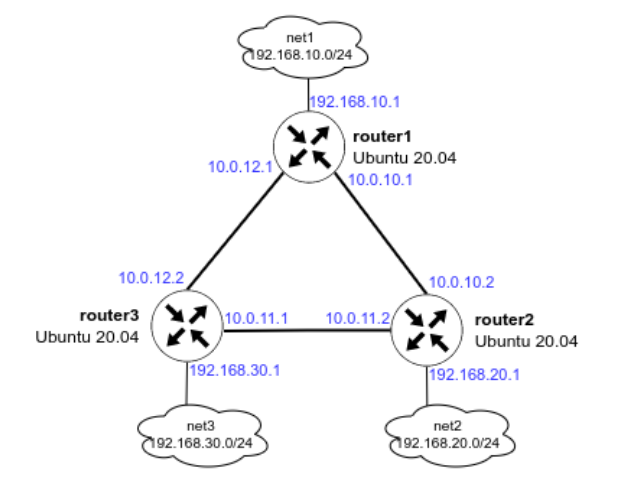

## Настройка окружения

```
vagrant up
```

## Решение

### Настройка ассиметричного роутинга

В файле provisioning/defaulе/main.yml установить
```
symmetric_routing: false
```

Cтоимость интерфейсов на router1:

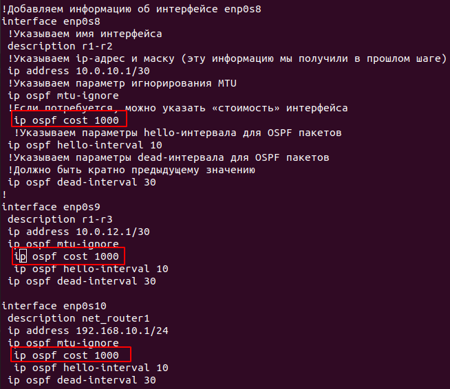

Cтоимость интерфейсов на router2:

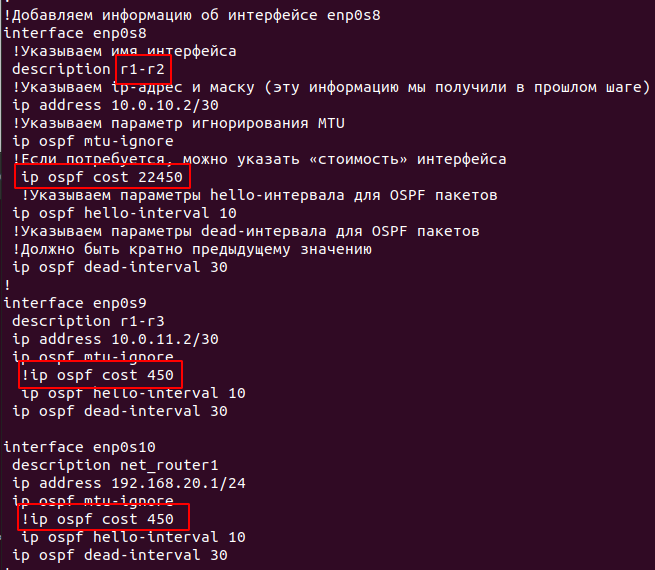

Маршрут до сети 192.168.20.0/30  теперь пойдёт через router2

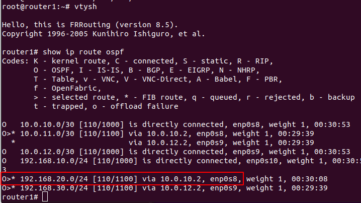

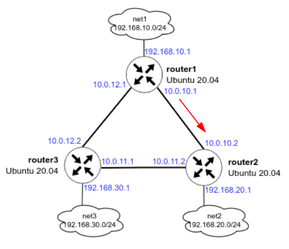

Обратный трафик от router2 пойдёт по другому пути:

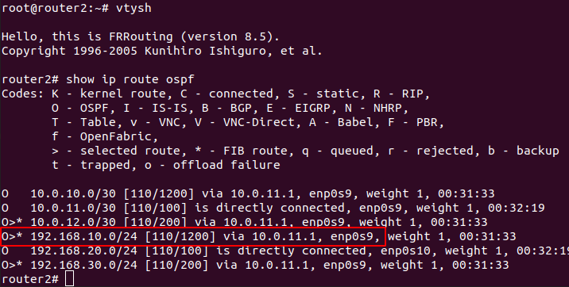

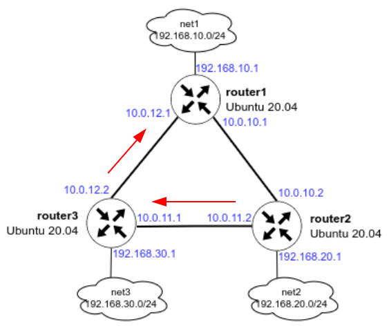

На router1 запускаем пинг от 192.168.10.1 до 192.168.20.1: 
```
ping -I 192.168.10.1 192.168.20.1
```

На router2 запускаем tcpdump, который будет смотреть трафик только на порту enp0s9:

```
tcpdump -i enp0s9
```

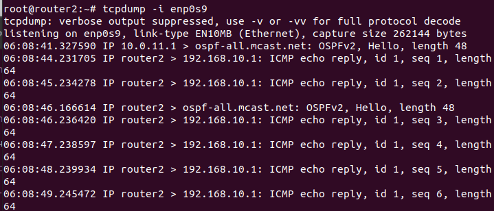

Видим что данный порт только отправляет ICMP-трафик на адрес 192.168.10.1

На router2 запускаем tcpdump, который будет смотреть трафик только на порту enp0s8:

```
tcpdump -i enp0s8
```

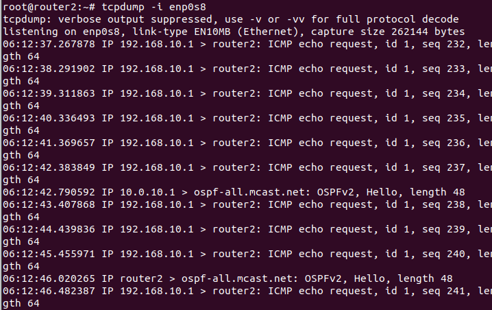

Видим что данный порт только получает ICMP-трафик с адреса 192.168.10.1.

Таким образом мы видим ассиметричный роутинг.


### Настройка симетричного роутинга

В файле provisioning/defaulе/main.yml установить
```
symmetric_routing: true
```

Cтоимость интерфейсов на router1:

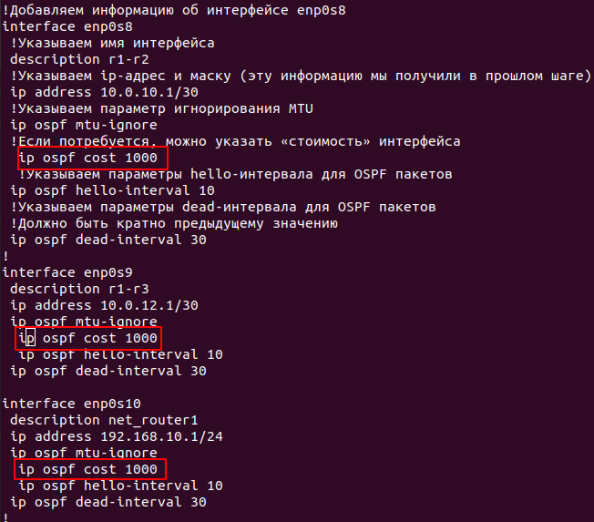

Cтоимость интерфейсов на router2:

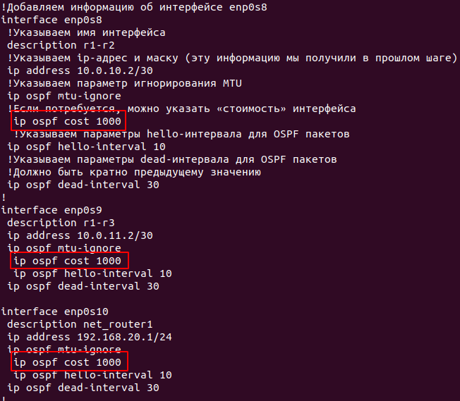

Маршрут до сети 192.168.20.0/30  теперь пойдёт через router2

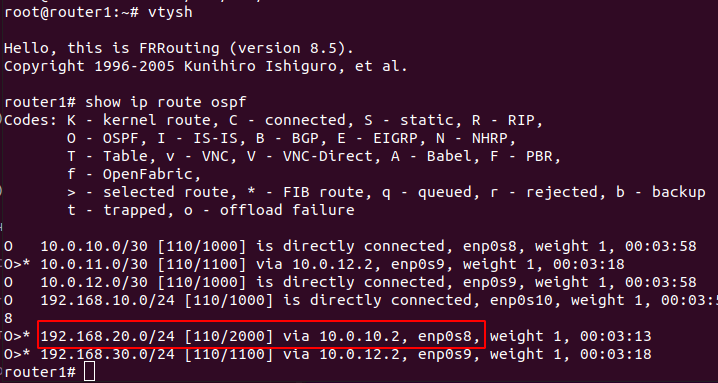

Обратный трафик от router2 пойдёт через enp0s8:

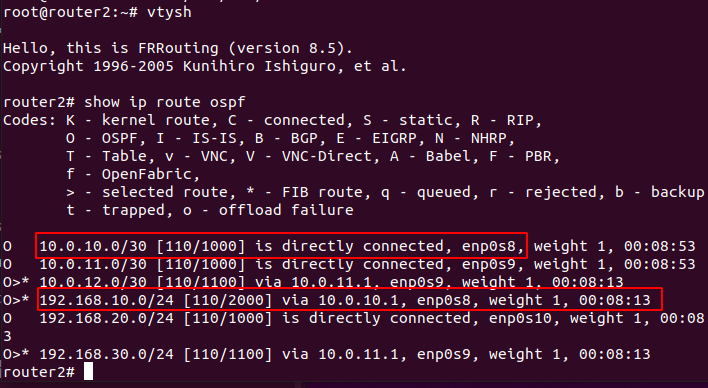

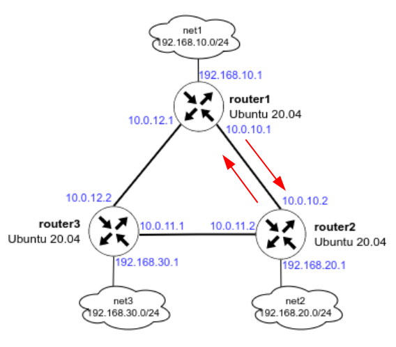

На router1 запускаем пинг от 192.168.10.1 до 192.168.20.1: 
```
ping -I 192.168.10.1 192.168.20.1
```

На router2 запускаем tcpdump, который будет смотреть трафик только на порту enp0s9:

```
tcpdump -i enp0s9
```

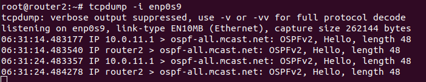


Смотрим интерфейс enp0s8:

```
tcpdump -i enp0s8
```

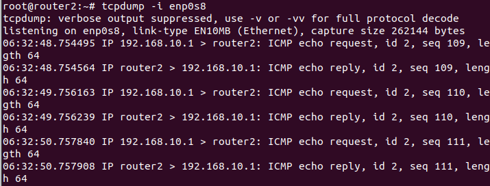

Теперь мы видим, что трафик между роутерами ходит симметрично.


