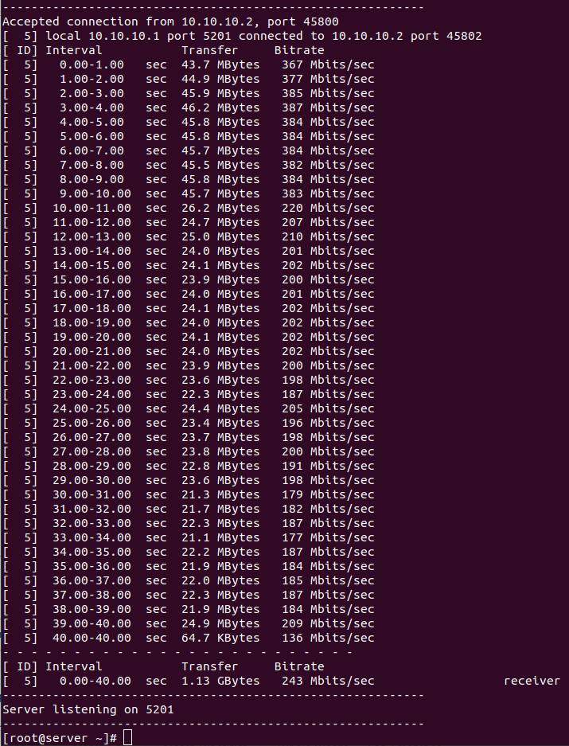
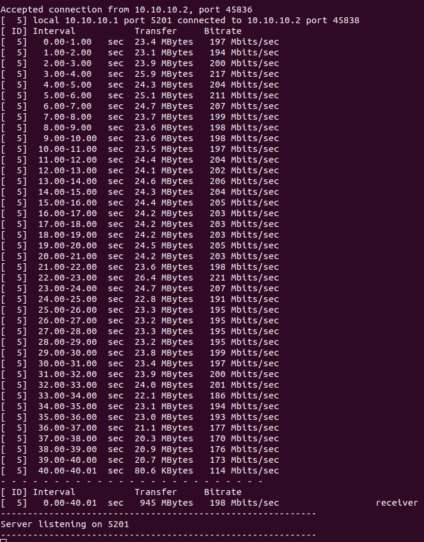
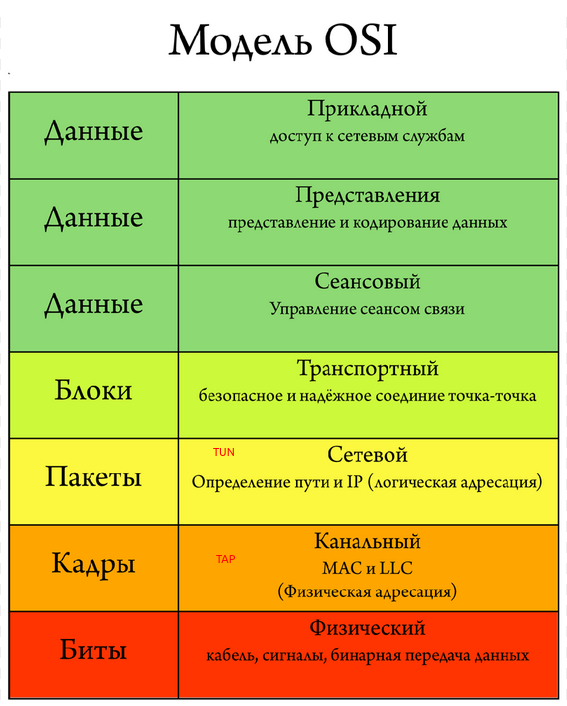

# VPN 

## Цель ДЗ

## Описание/Пошаговая инструкция выполнения домашнего задания:

Для выполнения домашнего задания используйте методичку:
https://drive.google.com/file/d/17b-DlGINS1EWyaXlHvG6z7tolPZrPAYq/view?usp=share_link
Что нужно сделать?

1. Между двумя виртуалками поднять vpn в режимах

   * tun;
   * tap;
     Прочуствовать разницу.

2. Поднять RAS на базе OpenVPN с клиентскими сертификатами, подключиться с локальной машины на виртуалку.
3. Самостоятельно изучить, поднять ocserv и подключиться с хоста к виртуалке*

Формат сдачи ДЗ - vagrant + ansible

## Решение

### Тестирование скорости в режиме TUN.

#### Настройка окружения

В файле provisioning/defaults/main.yml установить
```
vpn_mode: tun
```

Создать окружения
```
vagrant up --no-provision
vagrant up --provision
```

#### Замер производительности

На сервере запустить iperf3 в качестве сервера:
```
vagrant ssh server
sudo -i
iperf3 -s &
```

На клиенте, как клиент:
```
vagrant ssh client
sudo -i
iperf3 -c 10.10.10.1 -t 40 -i 5
```

где -t - время замера в секундах, -i - интервал времени вывода информации на экран.

#### Результаты замера

**Server**



**Client**


### Тестирование скорости в режиме TAP.

#### Настройка окружения

В файле provisioning/defaults/main.yml установить
```
vpn_mode: tap
```

Выполнить настройку
```
vagrant up --provision
```

#### Замер производительности

На сервере запустить iperf3 в качестве сервера:
```
vagrant ssh server
sudo -i
iperf3 -s &
```

На клиенте, как клиент:
```
vagrant ssh client
sudo -i
iperf3 -c 10.10.10.1 -t 40 -i 5
```

#### Результаты замера

**Server**



**Client**


### Вывод по сравнению скорости TUN и TAP

В моём случае в режиме TAP за 40 секунд было передно 946 MBytes со средней скоростью 198 Mbits/sec , в режиме TUN было передано 1,13 GBytes со средней скоростью 243 Mbits/sec. Исходя из этих результатов можно сделать вывод, что производительнось в режиме TUN выше.

### Прочуствовать разницу

Режимы TUN и TAP работают на разных уровнях модели сетевого взаимодействия OSI. 
TAP работает на канальном уровне OSI. TUN работает на сетевом уровне OSI.
TAP применяется для создания сетевых мостов, а TUN – для маршрутизации. 




