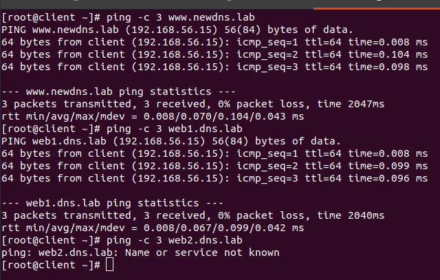

# Настраиваем split-dns 

## Описание/Пошаговая инструкция выполнения домашнего задания:

Для выполнения домашнего задания используйте методичку:
https://docs.google.com/document/d/13kjusaFEzv6Ip_9soeDj2Ry-6WK8IDX7/edit?usp=share_link&ouid=104106368295333385634&rtpof=true&sd=true

Что нужно сделать?

1. Взять стенд https://github.com/erlong15/vagrant-bind
*    добавить еще один сервер client2
*    завести в зоне dns.lab имена:
	- web1 - смотрит на клиент1
	- web2 смотрит на клиент2
*    завести еще одну зону newdns.lab
*    завести в ней запись
	- www - смотрит на обоих клиентов

2. Настроить split-dns
*    клиент1 - видит обе зоны, но в зоне dns.lab только web1
*    клиент2 видит только dns.lab

Дополнительное задание
* Настроить все без выключения selinux\*

Формат сдачи ДЗ - vagrant + ansible

## Настройка окружения

```
vagrant up
```

## Проверка

### Проверка на client:


На хосте мы видим, что client видит обе зоны (dns.lab и newdns.lab), однако информацию о хосте web2.dns.lab он получить не может.

### Проверка на client2:


client2 видит всю зону dns.lab и не видит зону newdns.lab.

### Проверка с отключенным nameserver 192.168.56.10

Для того, чтобы проверить что master и slave сервера отдают одинаковую информацию, в файле /etc/resolv.conf можно удалить на время nameserver 192.168.50.10 и попробовать выполнить все те же проверки.



Результат идентичный.

Информация поступает с nameserver 192.168.56.11


Если вернуть nameserver 192.168.56.10 в /etc/resolv.conf, то информация поступает уже с 192.168.56.10


