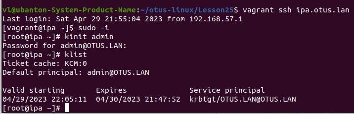
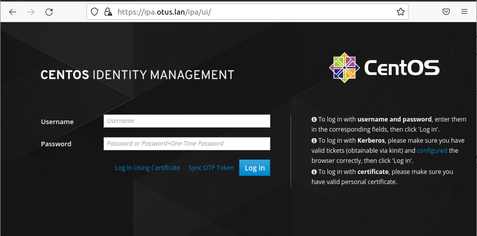
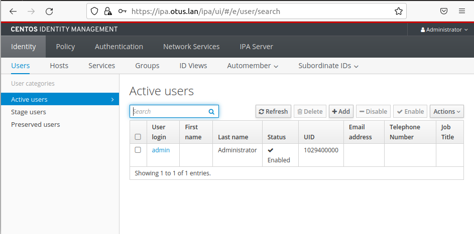
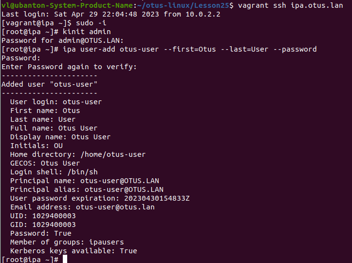
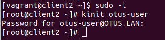
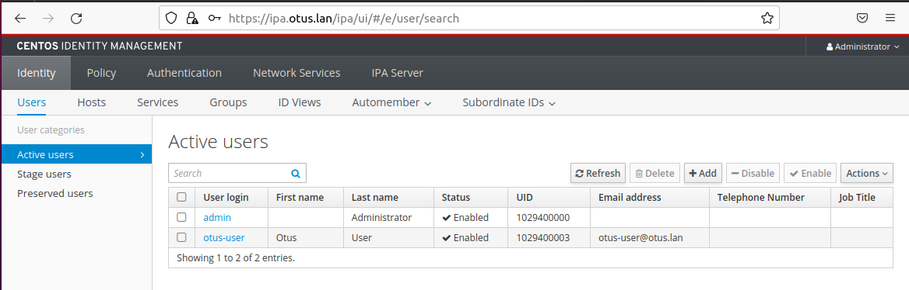
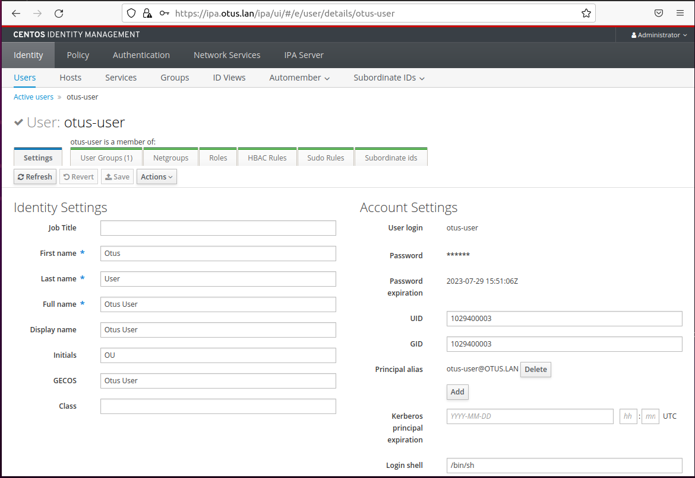

# Домашнее задание "LDAP"

## Описание/Пошаговая инструкция выполнения домашнего задания:

Для выполнения домашнего задания используйте методичку:
https://docs.google.com/document/d/1HoZBcvitZ4A9t-y6sbLEbzKmf4CWvb39/edit?usp=share_link&ouid=104106368295333385634&rtpof=true&sd=true

### Цель домашнего задания


### Описание домашнего задания

Что нужно сделать?

Установить FreeIPA;
1. Написать Ansible playbook для конфигурации клиента;
2. Настроить аутентификацию по SSH-ключам\*
3. Firewall должен быть включен на сервере и на клиенте\*
    
Формат сдачи ДЗ - vagrant + ansible

## Запуск

```
vagrant up
```

## Решение

Проверка kinit на на сервере ipa.otus.lan:



Web-интерфейс FreeIPA-сервера http://ipa.otus.lan



Активные пользователи:



Добавление пользователя otus-user на ipa.otus.lan
```
ipa user-add otus-user --first=Otus --last=User --password
```



Подключение На хосте client1


Подключение На хосте client2


Созданный пользователь otus-user в web-интерфейсе ipa:





