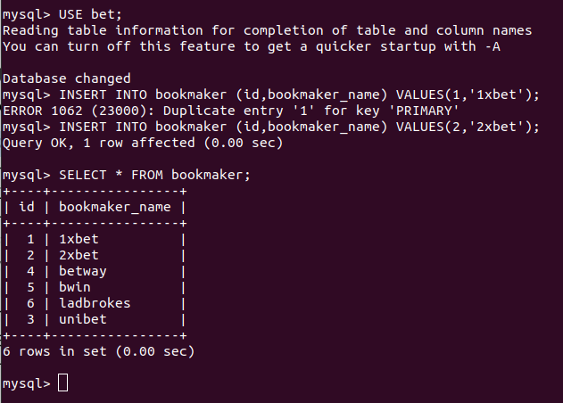

# Домашнее задание "Репликация mysql"

## Описание/Пошаговая инструкция выполнения домашнего задания:

Для выполнения домашнего задания используйте методичку:
https://drive.google.com/file/d/139irfqsbAxNMjVcStUN49kN7MXAJr_z9/view?usp=share_link

### Цель домашнего задания


### Описание домашнего задания

Что нужно сделать?

В материалах приложены ссылки на вагрант для репликации и дамп базы bet.dmp
Базу развернуть на мастере и настроить так, чтобы реплицировались таблицы:
| bookmaker |
| competition |
| market |
| odds |
| outcome

* Настроить GTID репликацию
  x
  варианты которые принимаются к сдаче:
  - рабочий вагрантафайл
  - скрины или логи SHOW TABLES
  - конфиги*
  - пример в логе изменения строки и появления строки на реплике*    

Формат сдачи ДЗ - vagrant + ansible

## Запуск

```
vagrant up --no-provision
vagrant up --provision
```

## Решение

### Подготовка окружения

Стенд с двумя виртуальными машинами master и slave создан на основе репозитория: https://gitlab.com/otus_linux/stands-mysql/-/tree/master/

#### Установка percona-server-57

Что такое percona-server: 

Percona Server — это не форк, это сборка обычной MySQL с дополнительными модулями от Петра Зайцева и Вадима Ткаченко и товарищей. Основная его изюминка — это включенный по умолчанию движок XtraDB storage engine. Отличается от MySQL + InnoDB plugin лучшей производительностью и масштабируемостью, особенно на современных многоядерных серверах. Также улучшена функциональность — больше всякой полезной для оптимизации статистики и прочего. В нем сохранена полная совместимость с таблицами InnoDB, то есть можно переключаться между InnoDB и XtraDB без каких-либо последствий (если не использовать некоторые специфичные для XtraDB функции, типа меньшего размера страницы).

См. https://xakep.ru/2014/09/09/percona-review/

Установка percona-server-57 выполняется по инструкции: https://docs.percona.com/percona-server/5.7/installation/yum_repo.html#whats-in-each-rpm-package

#### Примечания

- Пароль для базы MySQL указан в файле provisioning/defaults/vars.yml в открытом виде.
Для его скрытия можно использовать Ansible Vault. В данном ДЗ не реализовано.

Чтобы изменить пароль в базе данных заданный по умолчанию, выполняются следующие задачи:

```
- name: Change mysql password.
    command: sh /tmp/change-pswd.sh {{ mysqlpassword }}
    ignore_errors: true

- name: Login-path creation.
    command:  expect /tmp/login-path-creation.exp {{ mysqlpassword }}
    ignore_errors: true

  - name: Fix "You must reset you password..."
    command: mysql --login-path=local --connect-expired-password -e "ALTER USER 'root'@'localhost' IDENTIFIED BY '{{ mysqlpassword }}';"
    ignore_errors: true
```

- Статус выполнения mysql скриптов не всегда 0, поэтому provision интерпретирует этот как ошибку и процесс останавливается. Чтобы избежать этого в задачи добавлена опция `ignore_errors: true`.

- Для возможности копирования дампа базы данных с master на slave, были добавлены задачи генерации и обмена ключами между виртуальными машинами.
При обмене ключами, ключи скачиваются на host в папку buffer.
Различные варианты как это можно сделать, можно почитать по ссылке: https://www.middlewareinventory.com/blog/ansible-ssh-key-exchange/

Выбран вариант:

```
- name: Exchange Keys between servers
  become: yes
  become_user: vagrant
  hosts: servers
  tasks:
    - name: SSH KeyGen command
      tags: run
      shell: >
        ssh-keygen -q -b 2048 -t rsa -N "" -C "creating SSH" -f ~/.ssh/id_rsa
        creates="~/.ssh/id_rsa"
    - name: Fetch the keyfile from one server to another
      tags: run
      fetch:
        src: "~/.ssh/id_rsa.pub"
        dest: "buffer/{{ansible_hostname}}-id_rsa.pub"
        flat: yes
    - name: Copy the key add to authorized_keys using Ansible module
      tags: run
      authorized_key:
        user: vagrant
        state: present
        key: "{{ lookup('file','buffer/{{item.dest}}-id_rsa.pub')}}"
      when: "{{ item.dest != ansible_hostname }}"
      with_items:
        - { dest: "{{groups['servers'][1]}}"}
        - { dest: "{{groups['servers'][0]}}"}
```

### Проверка восстановления базы с сервера master на сервер slave

**__NOTE__**: Для логина в базы данных на master и slave виртуальных машинах используется команда: 

`mysql --login-path=local`

Проверка, что база данных была импортирована на сервер slave после настройки окружений с помощью инструментов Vagrant и Ansible выполняется командой:

```
SHOW DATABASES LIKE 'bet';
```


Проверка таблиц в базе данных bet на сервере slave:

```
USE bet;
SHOW TABLES;
```


### Проверка репликации с сервера master на сервер slave

Проверка статуса репликации на сервере slave:

```
SHOW SLAVE STATUS\G;
```

Видно, что репликация настроена и активна:


Выполнение операции вставки записи в таблицу bookmaker на сервере master:



Проверка репликации на сервере slave операции вставки выполненной на сервере master:


Отражение операции выполненной на сервере master в binlog на сервере slave:

Используемые binlog и операции в них:

```
SHOW BINARY LOGS;
SHOW BINLOG EVENTS;
```
 


