# Домашнее задание "Репликация Postgres"

## Описание/Пошаговая инструкция выполнения домашнего задания:

Для выполнения домашнего задания используйте методичку:
https://docs.google.com/document/d/1EU_KF3x9e2f75sNL4sghDIxib9eMfqex/edit?usp=share_link&ouid=104106368295333385634&rtpof=true&sd=true

### Цель домашнего задания

Научиться настраивать репликацию и создавать резервные копии в СУБД PostgreSQL

### Описание домашнего задания

Что нужно сделать?

* настроить hot_standby репликацию с использованием слотов
* настроить правильное резервное копирование

Для сдачи работы присылаем ссылку на репозиторий, в котором должны обязательно быть
* Vagranfile (2 машины)
* плейбук Ansible
* конфигурационные файлы postgresql.conf, pg_hba.conf и recovery.conf,
* конфиг barman, либо скрипт резервного копирования.

Команда `vagrant up` должна поднимать машины с настроенной репликацией и резервным копированием.  
Рекомендуется в README.md файл вложить результаты (текст или скриншоты) проверки работы репликации и резервного копирования.

Формат сдачи ДЗ - vagrant + ansible

## Запуск

```
vagrant up --no-provision
vagrant up --provision
```

## Решение

### Подготовка окружения

Создаётся стенд с тремя виртуальными машинами master, slave и barnam.
Параметры виртуальных машин задаются в файле Vagrantfile.

```
MACHINES = {
  :master => {
        :box_name => "centos/stream8",
        :ip_addr => '192.168.57.11'
  },
  :slave => {
        :box_name => "centos/stream8",
        :ip_addr => '192.168.57.12'
  },
  :barman => {
        :box_name => "centos/stream8",
        :ip_addr => "192.168.57.14"
  }
}
```

Проверка создания и запуска виртуальных машин: 
```
VBoxManage list runningvms
```

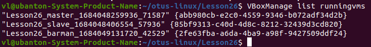

### Настройка hot_standby репликации с использованием слотов

#### Проверка настройки PostgreSQL на виртуальной машине master:

```
vagrant ssh master
sudo -u postgres psql
```

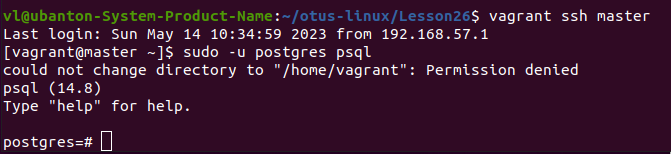

Проверка созданных пользователей:

```
select * from pg_catalog.pg_user;
```

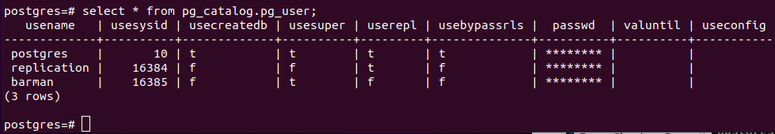

Проверка параметров подключения в файле /var/lib/pgsql/14/data/pg_hba.conf:

```
cat /var/lib/pgsql/14/data/pg_hba.conf
```

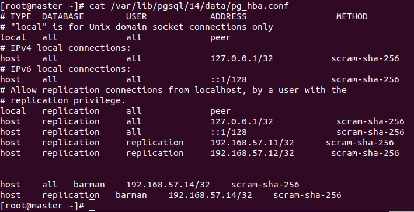

#### Проверка репликации с master на slave

Создание на хосте master в psql базы otus_test и вывод списка БД:

```
su postgres
psql
postgres=# CREATE DATABASE otus_test;
postgres=# \l 
```

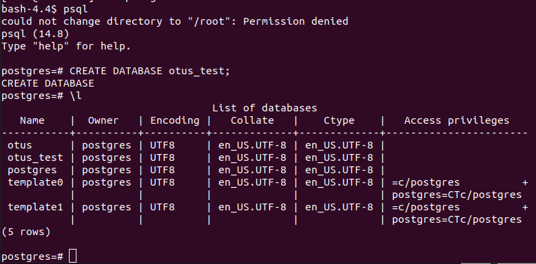


Проверка реплизации базы данных test на ВМ slave:

```
vagrant ssh slave
sudo -i
su postgres
psql
postgres=# \l
```

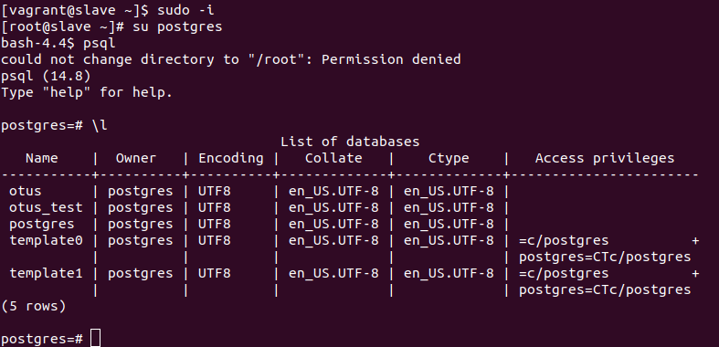

**Проверка другим способом:\**

На хосте master в psql ввести команду:

```
postgres=# select * from pg_stat_replication;
```

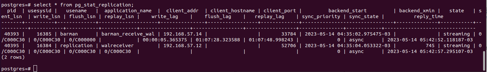

На хосте slave в psql ввести команду:

```
postgres=# select * from pg_stat_wal_receiver;
```

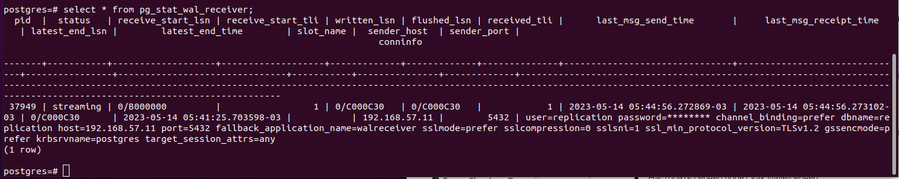

### Настройка резервного копирования

#### Проверка настроек

Проверка возможности подключения к postgres-серверу на ВМ barman:

```
vagrant ssh barman
sudo -i
su barman
bash-4.4$ psql -h 192.168.57.11 -U barman -d postgres 
```

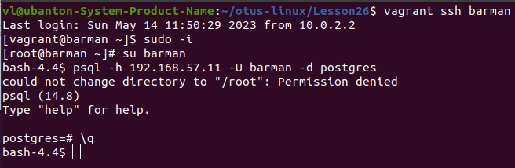

Проверяем репликации на ВМ barman:

```
bash-4.4$ psql -h 192.168.57.11 -U barman -c "IDENTIFY_SYSTEM" replication=1
``` 

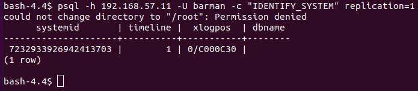

Проверка настроек репликации в файле /etc/barman.d/master.conf

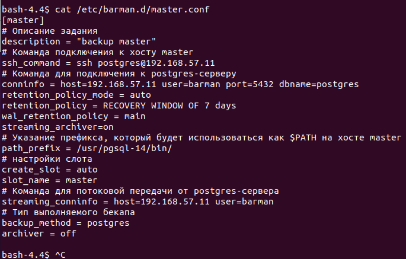

#### Проверка работы barman

```
bash-4.4$ barman switch-wal master
```

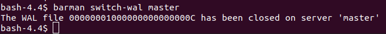

```
bash-4.4$ barman cron
bash-4.4$ barman check master
```

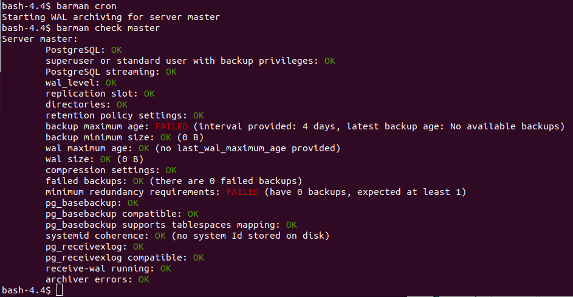

Создани резервной копии:

```
bash-4.4$ barman backup master
```

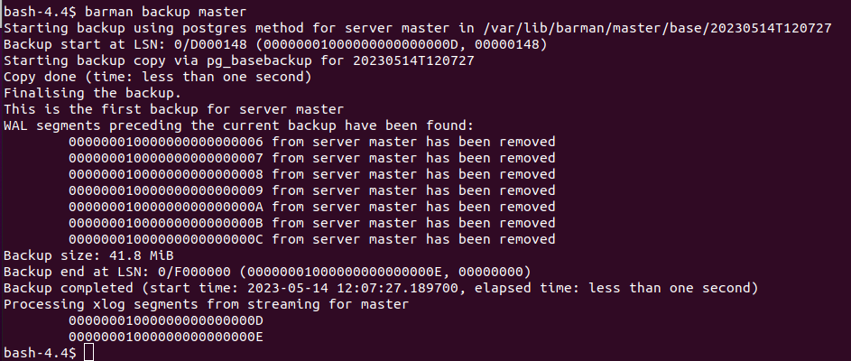

### Проверка восстановления из бекапов

На хосте master в psql удаляем базы Otus: 

```
vagrant ssh master
sudo -i
su postgres
psql
postgres=# \l
postgres=# DROP DATABASE otus;
postgres=# DROP DATABASE otus_test;
postgres=# \l
```

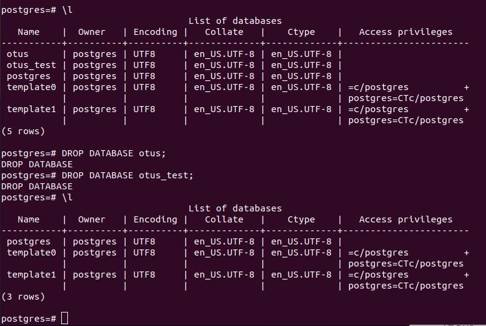

**__Примечание:__** базы данных также были удалены на slave. Это к вопросу зачем нужны бэкапы.

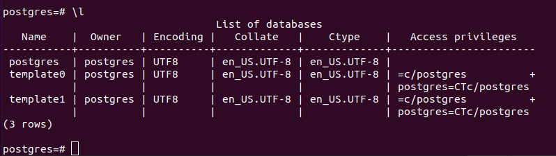

Запуск восстановления на хосте barman:

```
bash-4.4$ barman list-backup master
```

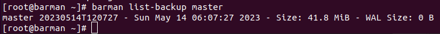


```
bash-4.4$ barman recover master 20230514T120727 /var/lib/pgsql/14/data/ --remote-ssh-comman "ssh postgres@192.168.57.11"
``` 

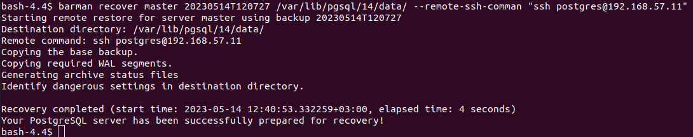

После восстановления требуется запуск PostgreSQL сервера на ВМ master:

```
systemctl start postgresql-14
systemctl status postgresql-14
```

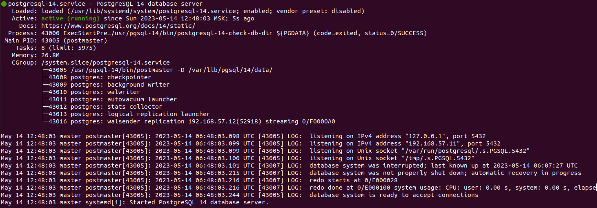


Проверка восстановления на ВМ master:

```
psql
postgres=# \l
```

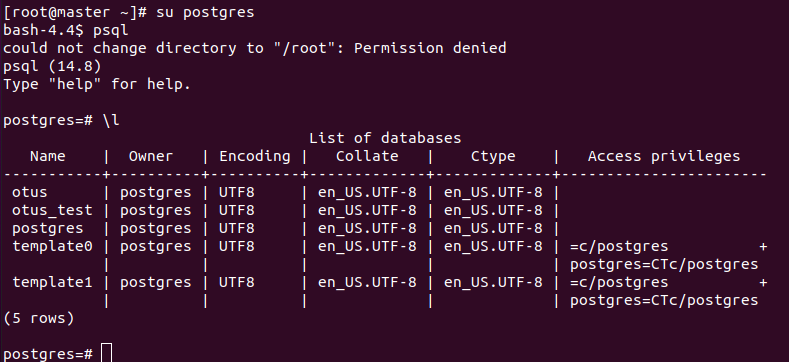

Проверка репликации на slave после восстановления базы данных на ВМ master:

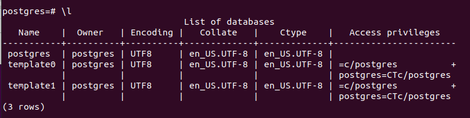

Автоматически восстановленная база данных на slave отражена не была.

Для запуска реплизации пришлось повторить шаги:

На хосте slave: 
1) Останавливаем postgresql-server: systemctl stop postgresql-14.service
2) С помощью утилиты pg_basebackup копируем данные с node1:
pg_basebackup -h 192.168.57.11 -U replication -p 5432 -D /var/lib/pgsql/14/data/ -R -P
listen_addresses = 'localhost, 192.168.57.12' 
3) Запускаем службу postgresql-server: systemctl start postgresql-14.service

После чего стали реплицироваться новые базыданных созданные на master:

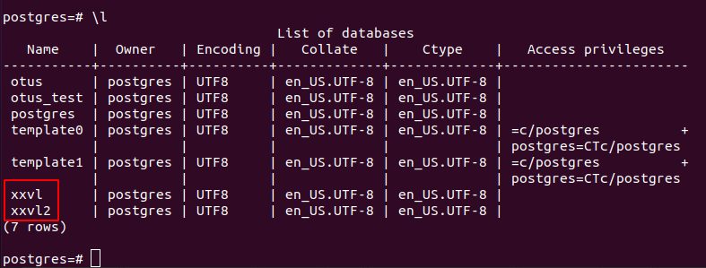


