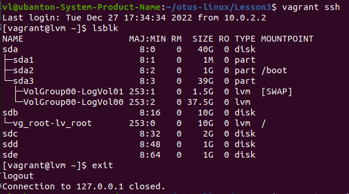
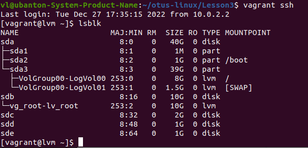
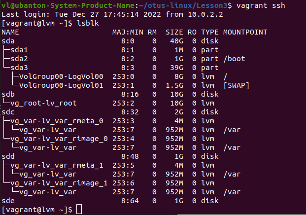
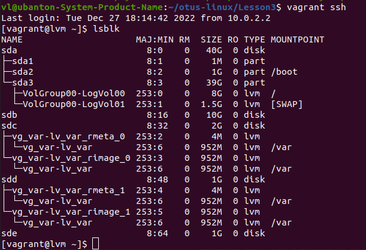

# Домашнее задание: "Работа с LVM"

## Описание/Пошаговая инструкция выполнения домашнего задания:

на имеющемся образе (centos/7 1804.2)
https://gitlab.com/otus_linux/stands-03-lvm
/dev/mapper/VolGroup00-LogVol00 38G 738M 37G 2% /

1. уменьшить том под / до 8G
2. выделить том под /home
3. выделить том под /var (/var - сделать в mirror)
4. для /home - сделать том для снэпшотов
5. прописать монтирование в fstab (попробовать с разными опциями и разными файловыми системами на выбор)
6. Работа со снапшотами:
*    сгенерировать файлы в /home/
*    снять снэпшот
*    удалить часть файлов
*    восстановиться со снэпшота
    (залоггировать работу можно утилитой script, скриншотами и т.п.)
*    на нашей куче дисков попробовать поставить btrfs/zfs:
*    с кешем и снэпшотами
*    разметить здесь каталог /opt

Методичка Работа с LVM https://drive.google.com/file/d/1DMxzJ6ctD0-I0My-iJJEGaeLDnIs13zj/view?usp=share_link

## Запуск

```
vagrant up --no-provision
vagrant provision --provision-with "lvm"
vagrant ssh -c "reboot"
vagrant provision --provision-with "to8g"
vagrant ssh -c "reboot"
vagrant provision --provision-with "var"
vagarant ssh -c "reboot"
vagrant provision --provision-with "the-end"
```

> **_NOTE:_** Насмотря на разные ухищрения подождать окончания перезагрузки после каждого этапа и организовать последовательность выполнения provisions, всё оказалось тщетно. Работает только в ручном режиме. 

> **_NOTE:_** Не помог VAGRANT_EXPERIMENTAL="dependency_provisioners". И не помог скрипт ожидания перезагрузки wait-vagrant-ssh.sh

## Решение

### Задача: "1. уменьшить том под / до 8G"
Выполняется командами:
```
vagrant provision --provision-with "lvm" (скрипт: lesson3-part1.sh)
vagrant ssh -c "reboot"
```



```
vagrant provision --provision-with "to8g" (скрипт: lesson3-part2.sh)
vagrant ssh -c "reboot"
```



### Задача "3. выделить том под /var (/var - сделать в mirror)"

Выплолняется командами:
```
vagrant provision --provision-with "var"
vagrant ssh -c "reboot"
```



```
vagrant provision --provision-with "the-end"
```



### Задача "6. Работа со снапшотами"

Решение представлено с помощью программного средства script:
```
scriptreplay --timing=scripts/time1.txt scripts/script1.log
scriptreplay --timing=scripts/time2.txt scripts/script2.log
```

