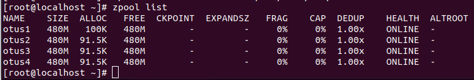
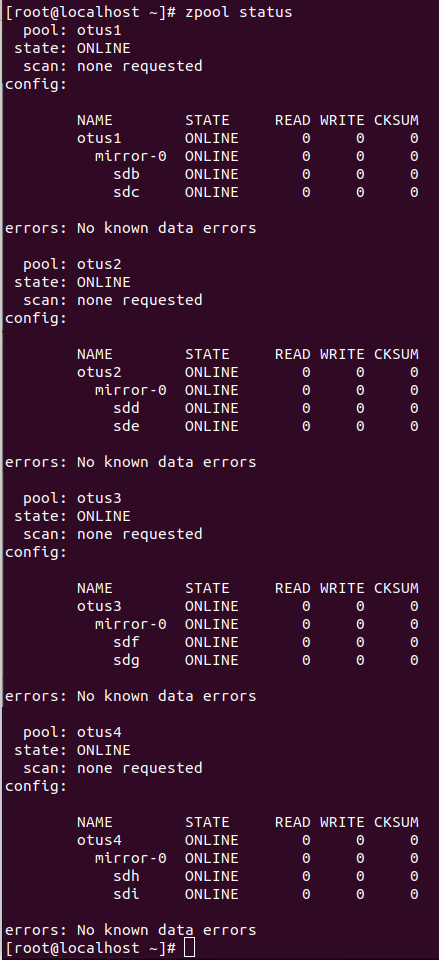
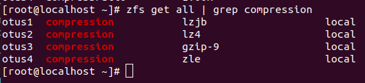
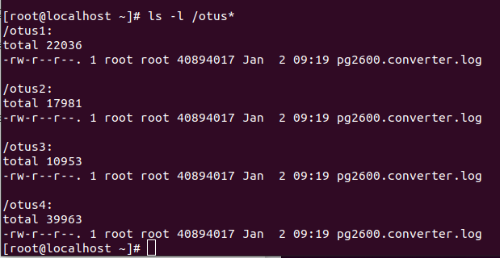
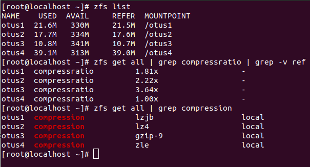
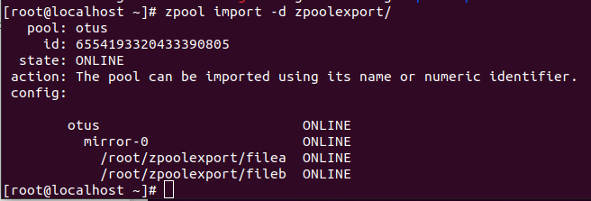
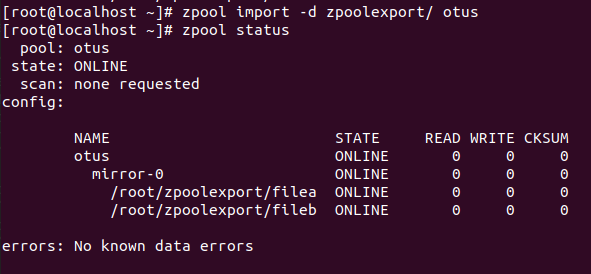
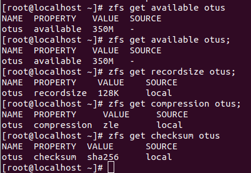
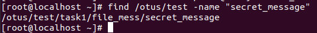
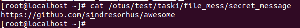

# Домашнее задание "Практические навыки работы с ZFS"

## Описание/Пошаговая инструкция выполнения домашнего задания:

1. Определить алгоритм с наилучшим сжатием.
Зачем: отрабатываем навыки работы с созданием томов и установкой параметров. Находим наилучшее сжатие.
Шаги:
* определить какие алгоритмы сжатия поддерживает zfs (gzip gzip-N, zle lzjb, lz4);
* создать 4 файловых системы на каждой применить свой алгоритм сжатия;  
Для сжатия использовать либо текстовый файл либо группу файлов:
* скачать файл “Война и мир” и расположить на файловой системе wget -O War_and_Peace.txt http://www.gutenberg.org/ebooks/2600.txt.utf-8, либо скачать файл ядра распаковать и расположить на файловой системе.

Результат:
- список команд которыми получен результат с их выводами;
- вывод команды из которой видно какой из алгоритмов лучше.

2. Определить настройки pool’a.
Зачем: для переноса дисков между системами используется функция export/import. Отрабатываем навыки работы с файловой системой ZFS.
Шаги:
* загрузить архив с файлами локально.
https://drive.google.com/open?id=1KRBNW33QWqbvbVHa3hLJivOAt60yukkg
Распаковать.
* с помощью команды zfs import собрать pool ZFS;
* командами zfs определить настройки:
	- размер хранилища;
	- тип pool;
	- значение recordsize;
	- какое сжатие используется;
	- какая контрольная сумма используется.
Результат:
	- список команд которыми восстановили pool . Желательно с Output команд;
	- файл с описанием настроек settings.

3. Найти сообщение от преподавателей.
Зачем: для бэкапа используются технологии snapshot. Snapshot можно передавать между хостами и восстанавливать с помощью send/receive. Отрабатываем навыки восстановления snapshot и переноса файла.
Шаги:
* скопировать файл из удаленной директории. https://drive.google.com/file/d/1gH8gCL9y7Nd5Ti3IRmplZPF1XjzxeRAG/view?usp=sharing
Файл был получен командой zfs send otus/storage@task2 > otus_task2.file
* восстановить файл локально. zfs receive
* найти зашифрованное сообщение в файле secret_message
Результат:
	- список шагов которыми восстанавливали;
	- зашифрованное сообщение.

Методичка Практические навыки работы с ZFS https://docs.google.com/document/d/1xursgUsGDVTLh4B_r0XGw_flPzd5lSJ0nfMFL-HQmFs/edit?usp=share_link

## Решение:

### 1. Определение алгоритма с наилучшим сжатием

Список всех дисков, которые ксть на виртуальной машине:
```
lsblk
```


Создание пулов в режиме RAID 1:
```
zpool create otus1 mirror /dev/sdb /dev/sdc
zpool create otus2 mirror /dev/sdd /dev/sde
zpool create otus3 mirror /dev/sdf /dev/sdg
zpool create otus4 mirror /dev/sdh /dev/sdi
```

Созданные пулы:

```
zpool list
```




```
zpool status
```




Добавление разных алгоритмов сжатия в каждую файловую систему:
- Алгоритм lzjb: zfs set compression=lzjb otus1
- Алгоритм lz4: zfs set compression=lz4 otus2
- Алгоритм gzip: zfs set compression=gzip-9 otus3
- Алгоритм zle: zfs set compression=zle otus4

Методы сжатия файловых систем:
```
zfs get all | grep compression
```



Скачивание файлов во все пулы:

```
for i in {1..4}; do wget -P /otus$i https://gutenberg.org/cache/epub/2600/pg2600.converter.log; done
ls -l /otus*
```



Проверим, сколько места занимает один и тот же файл в разных пулах и
проверим степень сжатия файлов:



#### Вывод

***Алгоритм gzip-9 самый эффективный по сжатию.***

## 2. Определение настроек пула

Скачивание архива в домашний каталог и его разархивирование:

```
wget -O archive.tar.gz --no-check-certificate 'https://drive.google.com/u/0/uc?id=1KRBNW33QWqbvbVHa3hLJivOAt60yukkg&e
xport=download'
tar -xzvf archive.tar.gz
```

Проверка, возможно ли импортировать данный каталог в пул:
```
zpool import -d zpoolexport/
```



Импорт пула otus в ОС:

```
zpool import -d zpoolexport/ otus
zpool status
```



Уточнение параметров пула:
```
zfs get available otus;
zfs get recordsize otus;
zfs get compression otus;
zfs get checksum otus
```



### 3. Работа со снапшотом, поиск сообщения от преподавателя

Скачивание файла, указанного в задании:
```
wget -O otus_task2.file --no-check-certificate 'https://drive.google.com/u/0/uc?id=1gH8gCL9y7Nd5Ti3IRmplZPF1XjzxeRAG&e
xport=download'
```

Восстановим файловую систему из снапшота: 
```
zfs receive otus/test@today < otus_task2.file
```

Далее, ищем в каталоге /otus/test файл с именем “secret_message”:
```
find /otus/test -name "secret_message"
```



```
cat /otus/test/task1/file_mess/secret_message
```




