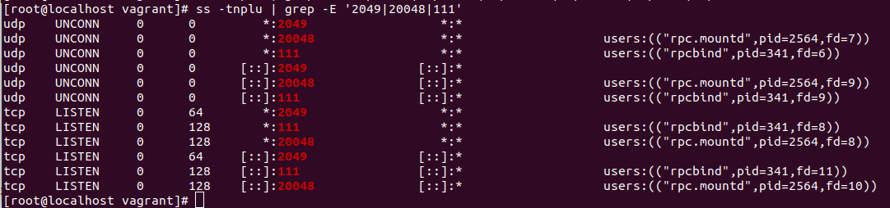
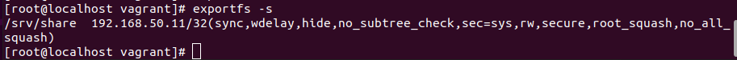
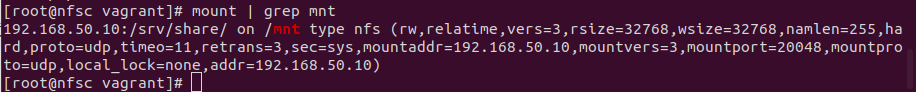
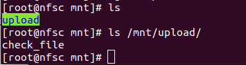
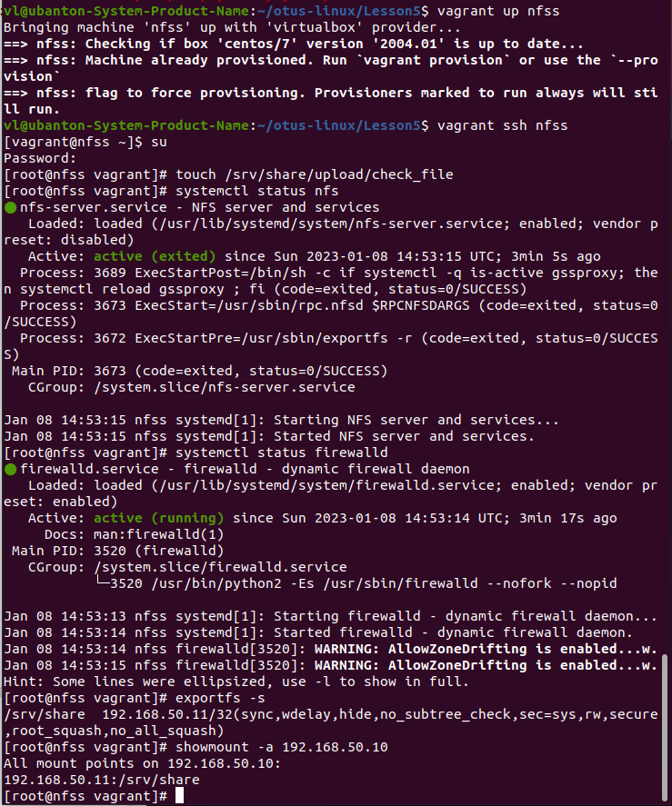
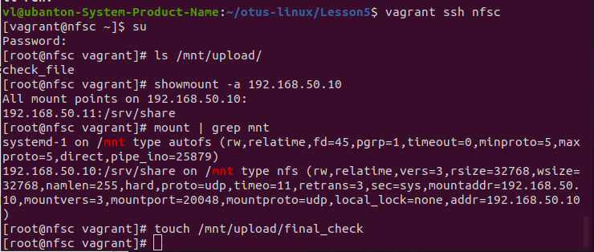
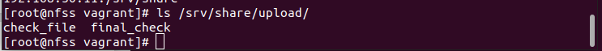

# Домашнее задание "Vagrant стенд для NFS"

*Цели домашнего задания:*
Научиться самостоятельно развернуть сервис NFS и подключить к нему
клиента

## Описание/Пошаговая инструкция выполнения домашнего задания:

*NFS:*
* vagrant up должен поднимать 2 виртуалки: сервер и клиент;
* на сервер должна быть расшарена директория;
* на клиента она должна автоматически монтироваться при старте (fstab или autofs);
* в шаре должна быть папка upload с правами на запись;
* требования для NFS: NFSv3 по UDP, включенный firewall.
* Настроить аутентификацию через KERBEROS (NFSv4)
Методичка Стенд Vagrant с NFS https://docs.google.com/document/d/1lW327eKqGJwGEXnu_XkXMvwgPkRjz3HWS0gx-tvDCR4/edit?usp=sharing

## Запуск
```
vagrant up
```

### Сервер
```
vagrant ssh nfss
su
touch /srv/share/upload/check_file.txt
```

### Клиент
```
vagrant ssh nfsc
su
ls /mnt/upload
```

## Описание каталогов и файлов в репозитории

	* Vagrantfile - файл автоматического создания виртуальных окружений
	* README.md - этот файл описания ДЗ
	* imgs - скриншоты для отображения в README.md
	* nfss_script.sh - файл-provision для настройки сервера nfss
	* nfsc_script.sh - файл-provision для настройки клиента nfsc

## Решение:

### Настройка сервера NFS

```
vagrant ssh nfss
su -i
```

Установка утилит для облегчения отладки
```
yum nstall nfs-utils
```

Включение firewall
```
systemctl enable firewall --now
systemctl status firewalld
```

Разрешаем в firewall доступ к сервисам NFS
```
irewall-cmd --add-service="nfs3" \
--add-service="rpc-bind" \
--add-service="mountd" \
--permanent
firewall-cmd --reload
```

Включение сервера NFS (для конфигурации NFSv3 over UDP он не требует
дополнительной настройки. С настройкой по умолчанию можно ознакомиться 
в файле /etc/nfs.conf)

```
systemctl enable nfs --now
```

Проверка наличия слушаемых портов 2049/udp, 2049/tcp, 20048/udp,
20048/tcp, 111/udp, 111/tcp (не все они будут использоваться далее, но
их наличие сигнализирует о том, что необходимые сервисы готовы
принимать внешние подключения)

```
ss -tnplu | grep -E '2049|20048|111'
```



Cоздаём и настраиваем директорию, которая будет экспортирована в будущем

```
mkdir -p /srv/share/upload
chown -R nfsnobody:nfsnobody /srv/share
chmod 0777 /srv/share/upload
```

Создание в файле __/etc/exports__ структуру, которая позволит экспортировать ранее созданную директорию
```
cat << EOF > /etc/exports
/srv/share 192.168.50.11/32(rw,sync,root_squash)
EOF
```

Экспорт директории /srv/share
```
exportfs -r
```

Проверка экспорта:
```
exportfs -s
```



### Настройка клиента NFS

```
vagrant ssh nfsc
su -l
```

Установка вспомогательных утилит:
```
yum install nfs-utils
```

Включение firewall
```
systemctl enable firewalld --now
systemctl status firewalld
```

Добавление в __/etc/fstab__ строку
```
echo "192.168.50.10:/srv/share/ /mnt nfs vers=3,proto=udp,noauto,x-systemd.automount 0 0" >> /etc/fstab
systemctl daemon-reload
systemctl restart remote-fs.target
```

Проверка успешности монтирования
```
mount|grep mnt
```



### Проверка работоспособности

Проверка созданного на сервере файла /srv/share/upload/check_file



Проверка созданного на клиенте файла /mnt/upload/client_file


Проверка работы сервера настроенного с помощью скрипта nfss_script.sh



Проверка работы клиента настроенного с помощью скрипта nfsc_script.sh



Проверка отображения на сервере файла final_check созданного на клиенте




