# Домашнее задание "Работа с загрузчиком"

## Описание/Пошаговая инструкция выполнения домашнего задания:


1. Попасть в систему без пароля несколькими способами.
2. Установить систему с LVM, после чего переименовать VG.
3. Добавить модуль в initrd.
4(*). Сконфигурировать систему без отдельного раздела с /boot, а только с LVM

Репозиторий с пропатченым grub: https://yum.rumyantsev.com/centos/7/x86_64/
PV необходимо инициализировать с параметром --bootloaderareasize 1m

Методичка Загрузка системы_Работа с загрузчиком https://drive.google.com/file/d/1-lfwAa6hOC-HVF2Agz9tj21vtKFyjDq7/view?usp=share_link

## Запуск

```
vagrant up
```

или с отладкой
```
vagrant up --debug &> vagrant.log
```

## Решение

### Попасть в систему без пароля несколькими способами

В установленном образе https://app.vagrantup.com/mercury131/boxes/centos-7-5-lvm/versions/1.1 неизвестен пароль root. 

Заходим на виртуальную машину:
```
vagrant ssh
```

При попытке сменить логин на root получаем ошибку:

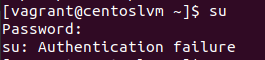

#### Способ 1. init=/bin/sh

Открыть GUI VirtualBox.

```
> VirtualBox
```

Запустить виртуальную машину и при выборе ядра длā загрузки нажать 'e'.  Попадаем в окно где изменяем параметры загрузки:

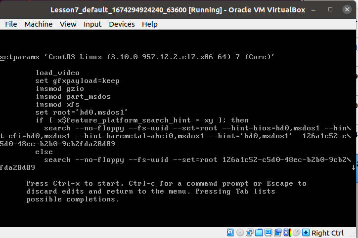

В конце строки начинающейся с linux16 добавлāем init=/bin/sh и нажимаем сtrl-x для
загрузки в систему.

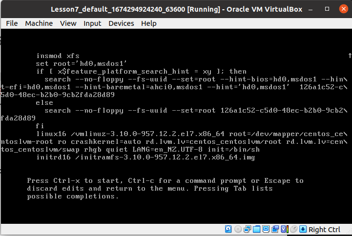

Перемонтирование рутовой файловой системы в режиме Read-Write.
```
mount -o remount,rw /
mount | grep root
```

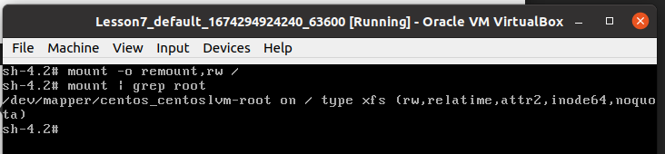

Меняем пароль root

```
passwd root
```

#### Способ 2. rd.break

В конце строки начинающейся с linux15 удаляем rhgb quiet добавляем rd.break enforcing=0 и нажимаем сtrl-x для
загрузки в систему

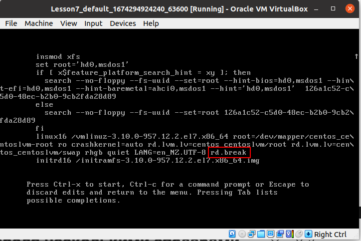

Попадаем в emergency mode. 
Попадаем в корневую файловую систему и поменять пароль администратора:
```
mount -o remount,rw /sysroot
chroot /sysroot
passwd
touch /.autorelabel
exit
mount -o remount,ro /sysroot
exit
```
После этого можно перезагружаться и заходить в систему с новым паролем. 
Полезно когда потеян или вообще не было известно пароль администратора.

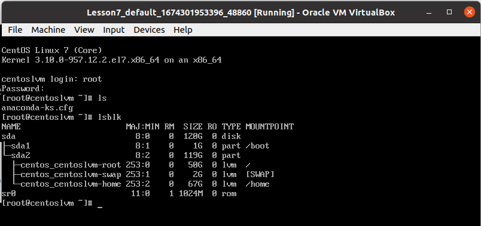

#### Способ 3. rw init=/sysroot/bin/sh

В строке начинаĀщейся с linux16 заменяем ro на rw init=/sysroot/bin/sh и нажимаем сtrl-x для загрузки в систему:

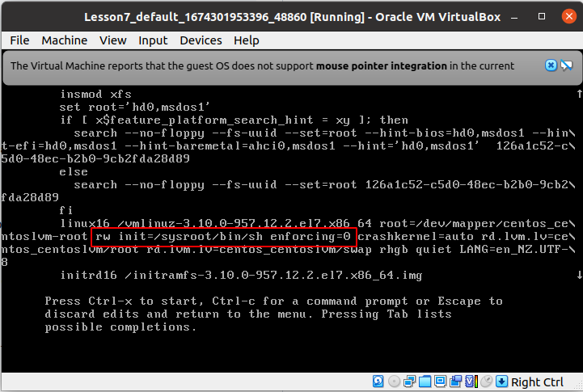

Меняем пароль:

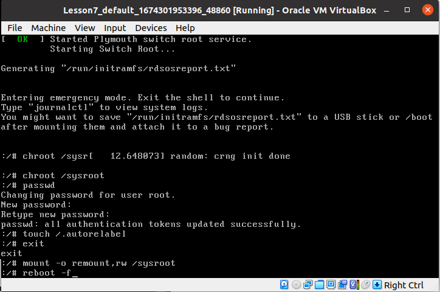

Входим под новым паролем:

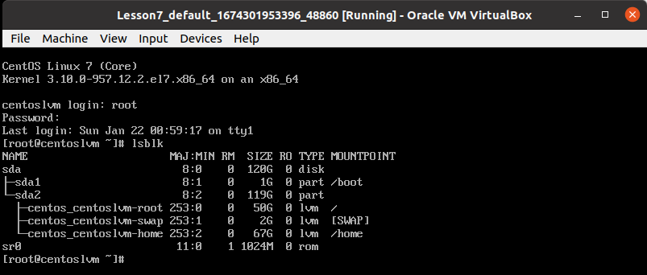


### Переименование VG

Текущее состояние системы:

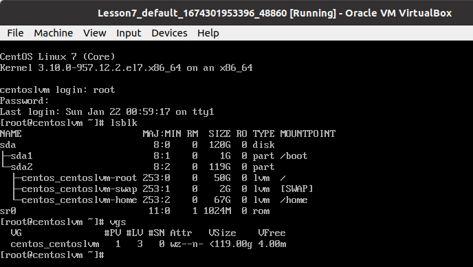

Переименование Volume Group:

```
vgrename centos_centoslvm OtusRoot
```
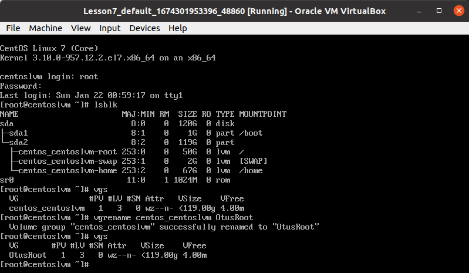

Далее правим /etc/fstab, /etc/default/grub, /boot/grub2/grub.cfg. Везде заменяем старое название на новое.

```
sed -i 's/centos_centoslvm/OtusRoot/g' /etc/fstab
sed -i 's/centos_centoslvm/OtusRoot/g' /etc/default/grub
sed -i 's/centos_centoslvm/OtusRoot/g' /boot/grub2/grub.cfg
```

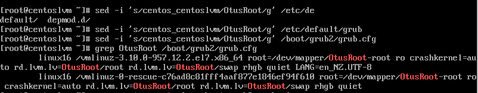

Пересоздаем initrd image, чтобы он знал новое название Volume Group

```
mkinitrd -f -v /boot/initramfs-$(uname -r).img $(uname -r)
```

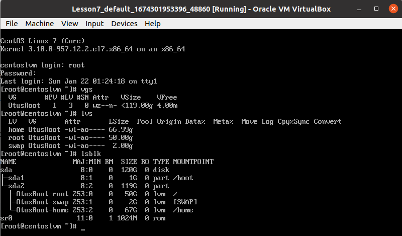

### Добавить модуль в initrd

Скрипты модулей хранятся в каталоге /usr/lib/dracut/modules.d/. Для того чтобы добавить свой модуль создаем там папку с именем 01test. 

```
mkdir /usr/lib/dracut/modules.d/01test
```

Скрипт который устанавливает модуль 01test:
```
#!/bin/bash

check() {
    return 0
}

depends() {
    return 0
}

install() {
    inst_hook cleanup 00 "${moddir}/test.sh"
}
```

Скрипт который вызывает скрипт модуля test.sh:
```
#!/bin/bash

exec 0<>/dev/console 1<>/dev/console 2<>/dev/console
cat <<'msgend'

Hello! You are in dracut module!

 ___________________
< I'm dracut module >
 -------------------
   \
    \
        .--.
       |o_o |
       |:_/ |
      //   \ \
     (|     | )
    /'\_   _/`\
    \___)=(___/
msgend
sleep 10
echo " continuing...."
```

Пересобираем образ initrd
```
mkinitrd -f -v /boot/initramfs-$(uname -r).img $(uname -r)
```
или
```
dracut -f -v
```

Можно проверить какие модули загружены в образ:
```
lsinitrd -m /boot/initramfs-$(uname -r).img | grep test
```


Убираем опции rghb и quiet в /boot/grub2/grub.cfg, чтобы увидеть вывод test.sh
Перегружаемся.

При перезагрузке видим результат работы модуля 01test:
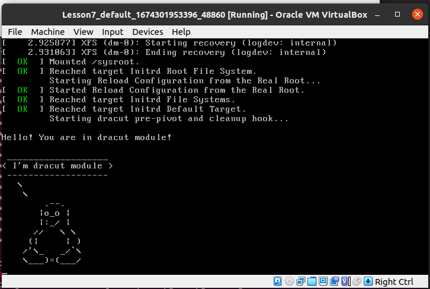


