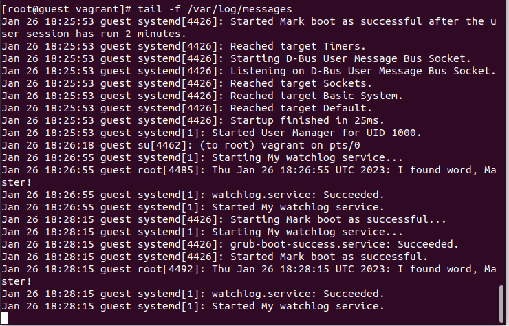

# Домашнее задание "Systemd"

## Описание/Пошаговая инструкция выполнения домашнего задания:

Выполнить следующие задания и подготовить развёртывание результата выполнения с использованием Vagrant и Vagrant shell provisioner (или Ansible, на Ваше усмотрение):

1. Написать service, который будет раз в 30 секунд мониторить лог на предмет наличия ключевого слова (файл лога и ключевое слово должны задаваться в /etc/sysconfig).

2. Из репозитория epel установить spawn-fcgi и переписать init-скрипт на unit-файл (имя service должно называться так же: spawn-fcgi).
    
3. Дополнить unit-файл httpd (он же apache) возможностью запустить несколько инстансов сервера с разными конфигурационными файлами.

4. Задание с *. Скачать демо-версию Atlassian Jira и переписать основной скрипт запуска на unit-файл.

Методичка Инициализация системы. Systemd 
https://drive.google.com/file/d/1QIJQ2Q0dxZJpDLfaP6Bhy4_DHKZdTVdg/view?usp=share_link

## Запуск

```
vagrant up
```

или с отладкой
```
vagrant up --debug &> vagrant.log
```

## Решение

### Написать сервис, который будет раз в 30 секунд мониторить лог на предмет наличия ключевого слова. Файл и слово должны задаватьсā в /etc/sysconfig

#### Файлы

1. ./scripts/init.sh - копирование необходимых скриптов в guest и создание сервисов;
2. ./sources/watchlog- файл с параметрами необходимыми для работы сервиса;
3. ./sources/watchlog.sh - скрипт сканирующий файл заданный в параметре LOG на наличие ключевого слова заданного параметром WORD;
4. ./sources/watchlog.service - сервис с помощью скрипта watchlog.sh сканирующий файл заданный в параметре LOG (см. ./sources/watchlog);
5. ./sources/watchlog.timer - сервис запускающий watchlog.service с периодичносью 30 сек.

#### Проверка работоспособности
Зайти на guest под root.
```
vagrant ssh
sudo -i
```

Проверить
Зайти на guest под root.
```
vagrant ssh
sudo -i
```

Проверить log на наличие сообщений "Started My watchlog service."
```
tail -f /var/log/messages
```



### Из epel установить spawn-fcgi и переписать init-скрипт на unit-файл. Имя
сервиса должно также называться.

#### Файлы
1. ./scripts/spawn-fcgi.sh - установка всего необходимого на guest
2. ./sources/spawn-fcgi - файл параметров
3. ./sources/spawn-fcgi.service - файл описания сервиса

#### Проверка

Зайти на guest под root.
```
vagrant ssh
sudo -i
```

Выполнить команду:
```
systemctl status spawn-fcgi
```

!(spawn-fcgi-service-status)[imgs/spawn-fcgi-service-status.png]

### Дополнить юнит-файл apache httpd возможностью запустить несколько инстансов сервера с разными конфигами

#### Файлы

1. ./scripts/httpd-init.sh - установка всего необходимого на guest
2. ./sources/https@.service - шаблон сервиса
3. ./sources/first.conf - первая конфигурация apache
4. ./sources/second.conf - вторая конфигурация apache
5. ./sources/httpd-first - параметр OPTIONS для первого сервиса определяющего путь к файлу настроек.
6. ./sources/httpd-second - параметр OPTIONS для второго сервиса определяющего путь к файлу настроек.

#### Проверка

Проверка первого сервиса
```
systemctl status httpd@first
```

!(httpd@first-status)[imgs/httpd@first-status.png)

Проверка второго сервиса
```
systemctl status httpd@second
```

!(httpd@second-status)[imgs/httpd@second-status.png)

Проверка портов:
```
ss -tnulp | grep httpd
```

!(check-ss)[imgs/check-ss.png)


