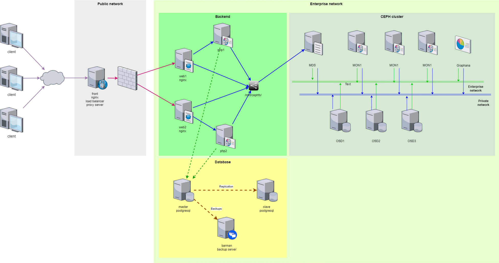
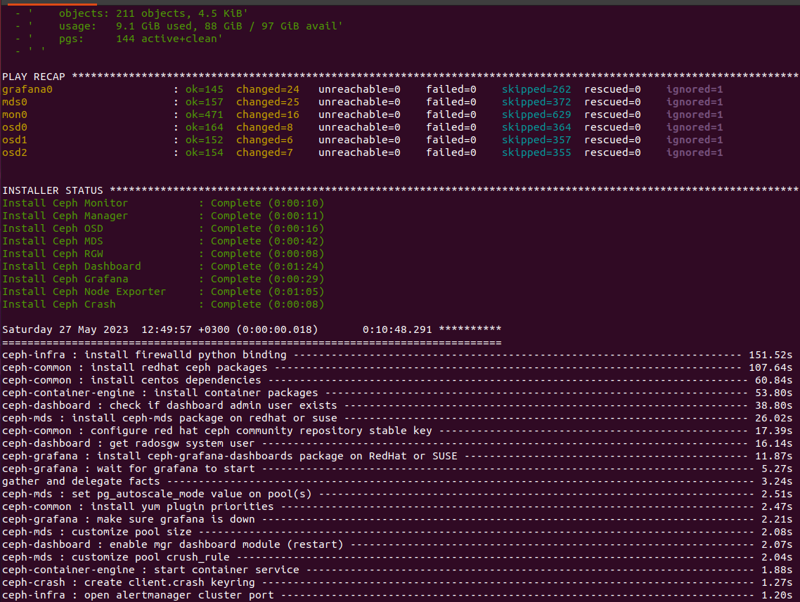

# Проект

**Содержание:**

[Цель](#target)
[Описание проектного решения](#project-description)  
	[Web-часть проекта. Требование "Web-приложение долно быть реализовано на php"](#web-desc)  
	[Требование "Выполнение php-скриптов должно быть реализовано на отдельных серверах"](#php-desc)  
	[Требования "включен https", "основная инфраструктура в DMZ зоне" и "firewall на входе"](#https-desc)  
	[Требование "каталог сайта бекэнда общий, кластерный"](#claster-desc)  
	[Доступ к Ceph MDS c клиентов](#mds-access)  
	[Требование "сбор метрик и настроенный алертинг"](#metrics)  
	[База данных](#db)  
	[Требование "организован backup"](#backup)  
[Установка проекта](#project-install)  
	[Требования к программному обеспечению](#software-requirements)  
	[Установка Ceph](#ceph-installation)  
	[Установка базы данных](#db-installation)  
	[Установка front и backend](#web-installation)  
[Настройки](#settings)  
	[Настройки Ceph](#ceph-setup)  
	[Настройки базы данных](#db-setup)  
	[Настройки front и backend ](#web-setup)  	

<a name="target"></a>
## Цель

Создание рабочего проекта
веб проект с развертыванием нескольких виртуальных машин должен отвечать следующим требованиям:

- Web-приложение долно быть реализовано на php;
- Выполнение самих php-скриптов web-приложения должно быть реализовано на отдельных серверах;
- включен https;
- основная инфраструктура в DMZ зоне;
- firewall на входе;
- каталог сайта бекэнда общий, кластерный;
- сбор метрик и настроенный алертинг;
- организован централизованный сбор логов (по желанию);
- организован backup.

<a name="project-description"></a>
## Описание проектного решения

**Архитектура**



<a name="web-desc"></a>
### Web-часть проекта. Требование "Web-приложение долно быть реализовано на php"

В качестве web-приложения было взято первое попавшееся web-решение написанное на php и работающее с PostgreSQL базой данных, 
которое было доработано для выполнения минимальной требуемой функциональности.

Данное web-приложение развертывается на двух backend-серверах, web1 и web2, с установленным на них Nginx. 

Для статического контента в Nginx на web1 и web2 выполнены следующие настройки:

``` 
  # Serving static files directly from Nginx without passing through uwsgi 
  location /app/favicon/ {
       alias {{project_path}}/app/favicon/;
  }

  location /.well-known/acme-challenge/ {
      root {{project_path}};
  }
```

См. файлы: coursework\web\provisioning\files\nginx.web1.conf.j2 и nginx.web2.conf.j2

<a name="php-desc"></a>
### Требование "Выполнение php-скриптов должно быть реализовано на отдельных серверах"

Для выполнения php-скриптов используются два отдельных сервера php1 и php2.
Каждый backend-сервер работает в паре со своим php-сервером, web1 - php1 и web2 - php2.

Выполнение php-скриптов на отдельном сервере настраивается в файле конфигурации /etc/nginx/conf.d/app.conf web-сервера Nginx добавлением следующей настройки:

```
location ~ \.php$ {
	include fastcgi_params;
	include fastcgi.conf;
	fastcgi_pass php1:9000;
  }
```
(см. шаблоны coursework\web\provisioning\files\nginx.web1.conf.j2 и nginx.web1.conf.j2)

<a name="https-desc"></a>
### Требования "включен https", "основная инфраструктура в DMZ зоне" и "firewall на входе"

Для реализации данных требований создан отдельный сервер front с установленным на нем Nginx.

Сервер front функционирует как балансировщик нагрузки (load balancer) для backend-серверов web1 и web2.

Для этого в файле конфигурации /etc/nginx/nginx.conf сервера front добавлены следующие настройки:

```
http {
  ...
  upstream app {
     least_conn;
     server 192.168.56.20;
     server 192.168.56.21;
  }
  ...
  server {
     listen 80;
     listen [::]:80;
     
     server_name app {{ server_name }};
     
     location / {
   	  proxy_pass http://app;
     }
  }
```

В качестве метода балансировки выбран метод **least_conn**, 
когда распределение запросов выполняется backend-серверу с наименьшим количеством активных подключений.

Настройка https начата, но не доведена до рабочего состояния.  
Застрял на шагах генерации сертификатов:  

```
  # Execute letsencrypt challenge.
  - name: Let the challenge be validated and retrieve the cert and intermediate certificate
    become: yes
    community.crypto.acme_certificate:
      account_key_src: "{{letsencrypt_account_key}}"
      csr: "{{letsencrypt_csrs_dir}}/{{domain_name}}.csr"
      cert: "{{letsencrypt_certs_dir}}/{{domain_name}}.crt"
      acme_directory: "{{acme_directory}}"
      acme_version: "{{acme_version}}"
      account_email: "{{acme_email}}"
      challenge: "{{acme_challenge_type}}"
      fullchain: "{{letsencrypt_certs_dir}}/{{domain_name}}-fullchain.crt"
      chain: "{{letsencrypt_certs_dir}}/{{domain_name}}-intermediate.crt"
      remaining_days: "{{remaining_days}}"
      data: "{{ acme_challenge }}"
    when: acme_challenge is changed
```

Cм. файл coursework\web\provisioning\provision-fronts-servers.yml  

Настройка выполняется на сервере front в конфигурационном файле /etc/nginx/nginx.conf.

```
    server {
        listen 443 ssl;
        listen [::]:443 ssl;
        ssl_certificate /etc/letsencrypt/certs/{{domain_name}}-fullchain.crt;
        ssl_certificate_key /etc/letsencrypt/keys/{{domain_name}}.key;
       

        server_name app {{ server_name }};

        location / {
           proxy_pass http://app;
        }
    }
```

(см. шаблон coursework\web\provisioning\files\nginx.front.conf.j2)

Основная инфраструктура в DMZ зоне от frontend пока не отделена из-за недоставтка времени на реализацию.

<a name="claster-desc"></a>
### Требование "каталог сайта бекэнда общий, кластерный"

Данное требование выполнено на основе ПО Ceph.

**Что такое Ceph?**
Ceph — отказоустойчивое распределенное хранилище данных, работающее по протоколу TCP. 
Одно из базовых свойств Ceph — масштабируемость до петабайтных размеров. 
Ceph предоставляет на выбор три различных абстракции для работы с хранилищем: 
абстракцию объектного хранилища (RADOS Gateway), блочного устройства (RADOS Block Device) 
или POSIX-совместимой файловой системы (CephFS).

> **_Ref:_** https://habr.com/ru/companies/performix/articles/218065/

Основных типов демонов в Ceph два — мониторы (MON) и storage-ноды (OSD).

**OSD (object storage daemon)** — сущность, которая отвечает за хранение данных, 
основной строительный элемент кластера Ceph. На одном физическом сервере может размещаться несколько OSD, 
каждая из которых имеет под собой отдельное физическое хранилище данных.

**Mon (Monitor)** — элемент инфраструктуры Ceph, который обеспечивает адресацию данных внутри кластера 
и хранит информацию о топологии, состоянии и распределении данных внутри хранилища. 
Клиент, желающий обратиться к блочному устройству rbd или к файлу на примонтированной cephfs, 
получает от монитора имя и положение rbd header — специального объекта, 
описывающего положение прочих объектов, относящихся к запрошенной абстракции 
(блочное устройство или файл) и далее общается со всеми OSD, участвующими в хранении файла.

Мониторы (Mon) объединяются в кворум и общаются по **PAXOS**-подобному протоколу. 
Собственно, кластер является работоспособным до тех пор, пока в нем сохраняется большинство участников сконфигурированного кворума.
При потере большинства кворума кластер «замораживается» для любых операций, 
предотвращая возможное рассогласование записанных или прочитанных данных до восстановления минимального кворума.

**Metadata server (MDS)** — вспомогательный демон для обеспечения синхронного состояния файлов в точках монтирования CephFS. 
Работает по схеме активная копия + резервы, причем активная копия в пределах кластера только одна.
Именно данный демон используется в проекте для возможности получения единой копии файлов приложения через монтирование к единой точке /mnt/cephfs/.

<a name="mds-access"></a>
#### Доступ к Ceph MDS c клиентов

На сервере mon получить ключ доступа, который указан в файле /etc/ceph/ceph.client.admin.keyring.  
Пример содержимого файла /etc/ceph/ceph.client.admin.keyring:  
```
[client.admin]
key = AQC+vHFkwPwbEBAA/e3LMvVdshUw0wOOxEJHzw==
caps mds = "allow *"
caps mgr = "allow *"
caps mon = "allow *"
caps osd = "allow *"
```

На клиенте выполнить команды:
```
mkdir /mnt/cephfs
mount -t ceph mon0:6789:/ /mnt/cephfs -o name=cephfs,secret=AQCb2HFkjDMjFRAArWY9S92mQIvFzHf9ZOdsiQ==
```

Расшифровка команды:
```
mount -t ceph <Monitor_IP>:<Monitor_port>:/ <mount_point_name> -o name=cephfs,secret=<admin_user_key>
```

<a name="metrics"></a>
### Требование "сбор метрик и настроенный алертинг"

Данное требование выполнено частично.
В составе Ceph-кластера "поднят" Prometheus и Grafana серверы, которые собирают метрики с серверов Ceph-кластера.
Было в планах настроить сбор метрик с backend-серверов и серверов базыданных.
Но это не было реализовано из-за недостатка времени.

<a name="db"></a>
### База данных

В качестве базы данных используется PostgreSQL настроенный по схеме master - slave.  
Данное архитектурное решение (master - slave) подходит для проектирования и реализации приложений согласно подходу CQRS.  

**Что такое Command and Query Responsibility Segregation (CQRS)?**  

CQRS – подход проектирования программного обеспечения, при котором код, изменяющий состояние, отделяется от кода, просто читающего это состояние.

В основе этого подхода лежит принцип Command-query separation (CQS).  

Основная идея CQS в том, что в объекте методы могут быть двух типов:  

    - **Queries**: Методы возвращают результат, не изменяя состояние объекта. Другими словами, у Query не никаких побочных эффектов.
    - **Commands**: Методы изменяют состояние объекта, не возвращая значение.

> **__Ref:__** https://habr.com/ru/companies/simbirsoft/articles/329970/


> **__Note:__** Подход CQRS в данном проекте не реализован.

<a name="backup"></a>
### Требование "организован backup"

Резервирование базы данных реализовано с использованием ПО Barman, менеджера бэкапов для серверов PostgreSQL.  
Для резервирование выделен отдельный сервер barman.

> **__Ref:__** Документация: https://docs.pgbarman.org/release/3.5.0/

<a name="project-install"></a>
## Установка проекта

<a name="software-requirements"></a>
### Требования к программному обеспечению

Решение было развернуто с использованием следующего программного обеспечения:  
  - Virtual Box
  - Vagrant
  - Ansible

Проектное решение разворачивается в следующем порядке:  

<a name="ceph-installation"></a>
### Установка Ceph

Перейти в фиректорию coursework\ceph-ansible.  
Выполнить команды:  

```
vagrant up --no-provision
vagrant up --provision
ansible-playbook site.yml -i hosts
```



Получение статуса Ceph кластера:  
```
vagrant ssh mon1
sudo -i
ceph -s
```

???

> **__Note__** Доустановка dashboard описана на ресурсе 
https://access.redhat.com/documentation/en-us/red_hat_ceph_storage/4/html/dashboard_guide/ceph-dashboard-installation-and-access

<a name="db-installation"></a>
### Установка базы данных

Перейти в фиректорию coursework\db.  
Выполнить команды:  

```
ansible-galaxy collection install community.postgresql
vagrant up --no-provision
vagrant up --provision
```

<a name="web-installation"></a>
### Установка front и backend

Перейти в фиректорию coursework\web.  
Выполнить команды:  

```
vagrant up --no-provision
vagrant up --provision
```

<a name="settings"></a>
## Настройки

<a name="ceph-setup"></a>
### Настройки Ceph

> **_Note__** Использовались материалы https://docs.ceph.com/projects/ceph-ansible/en/latest/index.html и https://red-hat-storage.github.io/ceph-test-drive-bootstrap/Module-2/

Скачать Ceph:  

```
git clone https://github.com/ceph/ceph-ansible.git
```

Для проекта выбрана версия nautilus.  

Для этого переключаемся в ветку  
```
git checkout nautilus
```

В файл coursework\ceph-ansible\hosts (inventory) внести информацию о серверах в соответствии с проектным архитектурным решением:  
```
[mons]
mon0 ansible_host=192.168.56.10 ansible_user=vagrant ansible_ssh_private_key_file=/home/vl/.vagrant.d/insecure_private_key

[monitoring]
mon0 ansible_host=192.168.56.10 ansible_user=vagrant ansible_ssh_private_key_file=/home/vl/.vagrant.d/insecure_private_key
 
[osds]
osd0 ansible_host=192.168.56.13 ansible_user=vagrant ansible_ssh_private_key_file=/home/vl/.vagrant.d/insecure_private_key
osd1 ansible_host=192.168.56.14 ansible_user=vagrant ansible_ssh_private_key_file=/home/vl/.vagrant.d/insecure_private_key
osd2 ansible_host=192.168.56.15 ansible_user=vagrant ansible_ssh_private_key_file=/home/vl/.vagrant.d/insecure_private_key

[mdss]
mds0 ansible_host=192.168.56.12 ansible_user=vagrant ansible_ssh_private_key_file=/home/vl/.vagrant.d/insecure_private_key
 
[mgrs]
mon0 ansible_host=192.168.56.10 ansible_user=vagrant ansible_ssh_private_key_file=/home/vl/.vagrant.d/insecure_private_key

[rgws]
mon0 ansible_host=192.168.56.10 ansible_user=vagrant ansible_ssh_private_key_file=/home/vl/.vagrant.d/insecure_private_key
 
[grafana-server]
grafana0 ansible_host=192.168.56.11 ansible_user=vagrant ansible_ssh_private_key_file=/home/vl/.vagrant.d/insecure_private_key
```

Скопировать файл с настройками
``` 
cp vagrant_variables.yml.sample vagrant_variables.yml
```

Внести в созданном файле требуемые параметры установки.
???

Указать количество требуемых виртуальных серверов:  
```
# DEFINE THE NUMBER OF VMS TO RUN
mon_vms: 3
osd_vms: 3
mds_vms: 1
rgw_vms: 0
nfs_vms: 0
grafana_server_vms: 1
rbd_mirror_vms: 0
client_vms: 0
iscsi_gw_vms: 0
mgr_vms: 0
```

Указать требуемое количество дисков:  
```
disks: [ '/dev/sdb', '/dev/sdc' ]
```
И опрерационную систему  
```
vagrant_box: centos/7
```

Скопировать файл  
```
cp coursework\ceph-ansible\site.yml.sample coursework\ceph-ansible\site.yml
```
???

Переименовать файл  
```
cp coursework\ceph-ansible\group_vars\all.yml.sample coursework\ceph-ansible\group_vars\all.yml
```

Внести в файл all.yml требуемые значения переменных.
???

Установить ip для public и cluster сетей:
```
# SUBNETS TO USE FOR THE VMS
public_subnet: 192.168.57
cluster_subnet: 192.168.10
```

В all.yml указать необходимость установки dashboard:
```
dashboard_enabled: True
```

Для доступа к dashboard в файле coursework\ceph-ansible\roles\ceph-defaults\defaults\main.yml требуется установить пароли:  
```
dashboard_admin_user: admin
dashboard_admin_user_ro: false
dashboard_admin_password: ********
```

Настройка и установка MDS описана на ресурсе 
https://access.redhat.com/documentation/en-us/red_hat_ceph_storage/2/html/ceph_file_system_guide_technology_preview/installing_and_configuring_ceph_metadata_servers_mds

<a name="db-setup"></a>
### Настройки базы данных

В файле coursework\db\provisioning\hosts указать сервера базы данных:  
```
[dbservers]
master ansible_host=192.168.56.31 ansible_user=vagrant ansible_ssh_private_key_file=.vagrant/machines/master/virtualbox/private_key 
slave ansible_host=192.168.56.32 ansible_user=vagrant ansible_ssh_private_key_file=.vagrant/machines/slave/virtualbox/private_key

[backuper]
barman ansible_host=192.168.56.33 ansible_user=vagrant ansible_ssh_private_key_file=.vagrant/machines/barman/virtualbox/private_key
```

В файле coursework\db\provisioning\defaults\vars.yml указывается пароль в базе данных.

Доступ к базе данных с других серверов настраивается на сервере master в файле /var/lib/pgsql/14/data/pg_hba.conf  

```
???
```

**Файлы:**  
provision-all.yml - общие настройки для всех серверов.  
install_postgres - установка PostgreSQL.  
install_barman - установка Barman.  
postgres_replication - настрока репликации.   
app - скрипты создания таблиц и других объектов базы данных приложения app.  
provision-db.yml - создание базы данных приложения app.  

#### Проверки barman

Проверяем репликации на ВМ barman:  
```
bash-4.4$ psql -h 192.168.56.32 -U barman -c "IDENTIFY_SYSTEM" replication=1
``` 

Проверка настроек репликации в файле /etc/barman.d/master.conf

Проверка работы barman:  

```
bash-4.4$ barman switch-wal master
```

Проверка настройки cron  
```
bash-4.4$ barman cron
bash-4.4$ barman check master
```

Создани резервной копии:  
```
bash-4.4$ barman backup master
```

<a name="web-setup"></a>
### Настройки front и backend

В файле coursework\web\provisioning\hosts указать сервера базы данных:  

```
[webservers]
web1 ansible_host=192.168.56.20 ansible_user=vagrant ansible_ssh_private_key_file=.vagrant/machines/web1/virtualbox/private_key 
web2 ansible_host=192.168.56.21 ansible_user=vagrant ansible_ssh_private_key_file=.vagrant/machines/web2/virtualbox/private_key
[phpservers]
php1 ansible_host=192.168.56.23 ansible_user=vagrant ansible_ssh_private_key_file=.vagrant/machines/php1/virtualbox/private_key
php2 ansible_host=192.168.56.24 ansible_user=vagrant ansible_ssh_private_key_file=.vagrant/machines/php2/virtualbox/private_key
[fronts]
front ansible_host=192.168.56.25 ansible_user=vagrant ansible_ssh_private_key_file=.vagrant/machines/front/virtualbox/private_key
```
**Файлы:**  
files - web приложение.  
provision-all-servers.yml - настройка всех серверов (web, php, front).  
provision-app.yml - установка приложения на общий ресурс Ceph-кластера (/mnt/cephfs).  
provision-ceph-servers.yml - подключение к общему ресурсу Ceph-кластера (/mnt/cephfs) web и php серверов.  
provision-fronts-servers.yml - настройка front-сервера (load balancer, https).  
provision-php-servers.yml - настройка php серверов для обработки php-скриптов.  
provision-web-servers.yml - настрока Nginx на backend-серверах (web1, web2).  

#### Настройка доступа к php-frm c backend-серверов (web1, web2)

Сервера с которых возможен доступ указывается в файле vim /etc/php-fpm.conf или vim /etc/php-fpm.d/www.conf  

```
listen.allowed_clients = 127.0.0.1
```
???

#### Проверка работоспособности php-fpm на серверах php

> **__Ref:__** https://stackoverflow.com/questions/14915147/how-to-check-if-php-fpm-is-running-properly  

```
ps aux | grep php-fpm
nmap localhost -p 9000
service php-fpm status
```

#### Настройка логирования в php-fpm

> **__Ref:__** https://bobcares.com/blog/php-fpm-error-reporting/  

В файле /etc/php-fpm.d/www.conf раскомментировать строку:
```
catch_workers_output=yes
```

Где искать логи указано в файле /etc/php-fpm.conf  
```
error_log = /var/log/php-fpm/error.log
```  
> **__Ref:__** https://serverfault.com/questions/574880/nginx-php-fpm-error-logging

Ошибки приложения указаны см. файле /var/log/php-fpm/www-error.log
